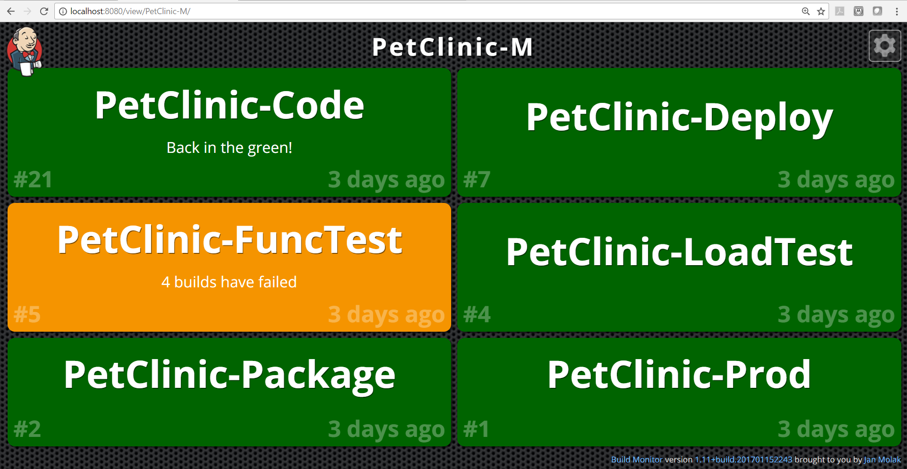
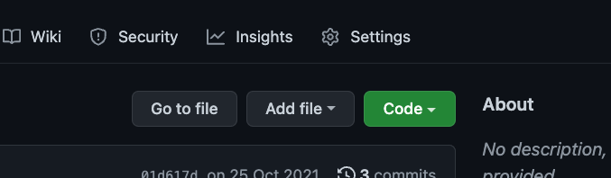
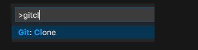
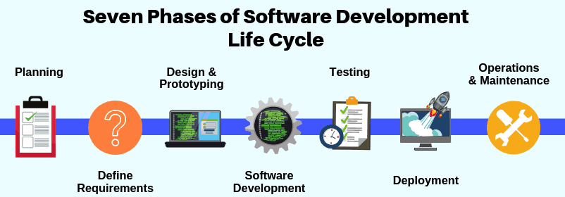

# Session 1

## Getting Started

### Setting up the environment

This bootcamp will require a local integrated development (IDE) to be used. For this we will need to install and set up Visual Studio Code (for the sake of consistency we will use the same IDE).

If you haven't already, install Visual Studio Code from [here](https://code.visualstudio.com/download).

### Installing plugins/extensions

As with all IDEs, they come with additional, useful extensions. For the use within the bootcamp and to support future development we will need to install the following plugins:

- Live Server: This allows us to run javscript locally and see changes every time we save files.
- Live Share: This will allows us to collaboratively development via pair programming
- Live Share Extension Pack: Provides useful tools to support Live Share
- Prettier: This will help format code upon save
- Jest Runner: plugin to help with testing
- Jest Snippets: extension to help with writing tests
- GitLens: useful for git specific actions such as looking at history, commits etc.
- Error Lens: highlights errors in your file
- (Optional) Indent Rainbow
  
There are other useful extensions such as (we won't be installing these):

- GitHub Repositories: This allows you to quickly edit files on a remote repository without having the need to clone it. 
- GitHub Pull Requests and Issues: allows you to review and manage GitHub pull requests and issues.

## Version Control

A long time ago people used to rely on physical storage in order to save files. Remember these?


Whenever we work on say a word document, we always tend to save our files or have a setting enabled that automatically saves the file after so many seconds. When coding, the process of saving our work is very important as well.

While passing discs around friends may seem possible, can you imagine employees from companies like Google, Facebook doing the same? Nope.

All companies now use some form of source control whereby whatever code they write, it is persisted (saved), in a safe location and is accessible 24/7 365 days of the year! Impressive hey?

This has been made possible with the introduction of something we refer to in software as Version Control (VCS) or a Version Control System.

Version Control Systems have been around for many years and every company who makes use of software will be using such a system. In the software world, there are various types or flavours of Version Control Systems:

| VCS Name  |
| --------- |
| ClearCase |
| Perforce  |
| Vault     |

There are some non-propriatery, free. open source VCS:

| VCS Name   |
| ---------- |
| Subversion |
| Mercurial  |
| CVS        |

VCS systems are however split into two domains: Client-Server and Distributed.

### Repository

When we as developers make code changes, we send our changes to a VCS. Within a VCS you will multiple repositories. Repositories are simply a central storage for a given project, so think of it as a single folder inside a filing cabinet.

For each project we work on, we make a new repository (i.e. a folder).

### Centralised Version Control

The _client-server_ approach is where you have a server for VCS system housed within your organisation, on some super powered server and all the developers log into and connect to that server. This is good but it does open up the business' risk as they could lose that server if say they had a natural disaster/fire.

As a developer, you would log into a server and would only work whilst connected to the server. In some cases this would mean you're only able to work, if at the office, not at home.

This is also referred to as a **Centralised VCS** and is illustrated below.


### Distributed Version Control

The other strategy of a VCS system is the **distributed** approach where you have your VCS system mirrored on every developers machine.

The benefit of this is:

- Allows users to work productively when they are not connected to the internet as they have a mirrored version of the codebase.
- There is no need for constant communication with others when making changes. If you make a change, you only need to communicate once you are in a position of sharing the content amongst your team.
- One key benefit is having a local copy. If for any reason a remote copy goes AWOL, you still have the code available locally.
- The other benefit, although somewhat cheeky, I get to work from home from time to time! Bonus!

A comparison between a Centralised VCS and a Distributed VCS can be seen in the following image:


### Distributed Version Control

The other strategy of a VCS system is the **distributed** approach where you have your VCS system mirrored on every developers machine.

The benefit of this is:

- Allows users to work productively when they are not connected to the internet as they have a mirrored version of the codebase.
- There is no need for constant communication with others when making changes. If you make a change, you only need to communicate once you are in a position of sharing the content amongst your team.
- One key benefit is having a local copy. If for any reason a remote copy goes AWOL, you still have the code available locally.
- The other benefit, although somewhat cheeky, I get to work from home from time to time! Bonus!

A comparison between a Centralised VCS and a Distributed VCS can be seen in the following image:


One of the most popular distributed version control systems on the market is Git, which is a free/open source system. It was developed back in 2005 by the creator of the Linux operating system.

The majority of organisations/software houses now use Git as their underlying version control system.

You're probably wondering why it's called Git. Well, this is what the creator said himself:

> "I'm an egotistical ba\*\*\*rd, and I name all my projects after myself. First 'Linux', now 'git'."

#### Overview

- Version Control System (VCS) for tracking changes in computer files.
- It is operating system agnostic, meaning it can be used on Linux based systems, Windows etc.
- It has no specific language/framework. It simply stores files!
- Distributed version control - meaning that you can have multiple developers making changes to the same project and they don't need to be on the same network to do so.
- Co-ordinates work between multiple developers and tracks every single change to every file within your project.
- Git tracks the files, when they were changed and by who. This is a crucial part of Git as it helps to identify issues in files and when they were introduced, i.e. when tracking bugs.
- Revert changes back at any time. Really helpful as this can and does occur!
- Git has a concept of repositories (mentioned previously). Local and remote repositories are used within Git. Local repositories are on your own machine and do not need an internet connection but if you want to **push** your changes up to a remote repository, then you will. We'll see examples of this soon.

#### So why do we use Git?

- Keeps track of code history.
- Git takes "snapshots" of your files.
- You decide when to take a snapshot by making a **commit**. We'll see this in action later.
- Great thing about Git is you can revisit snapshots at any time.
- You can also _stage_ your files prior to committing them. Staging files means storing them to one side so that you can later use them and commit them.
- When you push changes to a remote repository, other developers can only then see your changes.
- You can also create something called a **branch**. Explained later in this section.

Note: It is much more beneficial learning the Git commands via a terminal window, initially and then using/relying on an IDE (such as IntelliJ, Visual Studio etc). This way you will understand _how_ Git _actually_ works under the hood.

#### How does Git actually work?

Before we deep dive into using Git, we should under how Git works.

- A repository (or usually referred to as repo for short), is a container for a project you want to track changes for with Git (e.g. a website project)
- You can have many different repositories for many projects on your computer _at once_.
- You can think of a repository as a folder on your computer that Git keeps a track of.

##### Tracking

So how does a Git tracked project look like?

Imagine this is a website project folder called 'my-cv':

```shell
my-cv
    ---> .git
    ---> /public
    ---> logo.png
    ---> styles.css
    ...
```

The key folder here is the 'hidden' folder called **.git**. Inside of this folder is where Git keeps track of all your local changes for the project you are working on, so in this example, 'my-cv'.

##### Commit History

Whenever we make local changes, we save them. When we want those changes to be saved to our repository, we have to **commit** them.

Think of a commit history as a timeline. When we start working on a file, it has an empty timeline as the only file we have is the initial one we started with. When we start making changes to the file and commit the file to Git, we add a commit marker, known as a _commit hash_ for that file. We will see this illustrated in our practical session later.

## Getting Started with Git

Before we do this, we **must** add our name and email address to Git so that we can mark all our snapshots, comments and files with our name and email. 

Why is this important? This will help others identify who has made the changes which is important when you come to working in a large team.

To do this, type:

```shell
$ git config --global user.name '<your name>'
$ git config --global user.email '<your email address>'
```

Here your email address can be a personal email address for now but ideally this will be a company email address. This way anyone wanting to contact you can do so.
  
### Setting up our first repository

Open Visual Studio Code navigate to the **session-1** folder and create a new folder 'git-intro'.

If you navigate to the 'Source Control' option on the left hand side of Visual Studio Code you will see a button asking if you would like to initialise the repository. Click this button.

### Initialise Repositories

By clicking the initialisation button, you should now see a **.git** folder appear in the root of your project folder.

This now means that our project is now being *tracked* by git.

NOTE: For the remainder of the bootcamp, Visual Studio Code will either be abbreviated to VSCode or referred to as 'IDE'.

### Staging Files

Now we have initialised our repository, we can now start adding content and those files/folders to our tracking:

1. Inside the `git-intro` folder, create an `index.html` file and then open it inside the IDE.

> Tip: A quick tip for creating boiler-plate (template)  HTML in VSCode is type '!' and then press enter.

If you haven't already, add template HTML content to the `index.html` file using the tip mentioned.

2. If you look at the 'Source Control' option on the left, you will see the file `index.html` appearing in the list.
3. For now, enter the following content between the `<body></body>` tags:

```html
<h1>Get Ready Bootcamp 2022</h1>
```

4. Whilst we are there, change the content between the `<title>` tag and put `Get Ready Bootcamp 2022`.
5. To add or stage this file and other changes, navigate back to the 'Source Control' option on the left, you will see a '+' symbol that let's you _stage_ files.
6. Proceed and stage all changes.

For now, we will leave these changes as staged.

### Checking status of files/folders

If you stage files you can also verify the current state of your workspace. To do this, you can open the integrated terminal and typing `git status` or you can simply just look at the 'Source Control' option and check files/folders that are _staged_ or _unstaged_ (as in not added).

### Reverting staged files/folders

There may be times where you stage a file or folder and later realise you dont want to add it to git just now. If so:

1. Navigate to the 'Source Control' option and hover over the files/folders.
2. Click on the '-' icon next to the file/folder that states 'Unstage changes'.

This will then move the file/folder back to being _unstaged_ keeping the changes you have made however on those files/folders. Therefore no changes are lost by doing this action.

### Committing

Now we've seen how we can add files (and folders for that matter) to the staging area, we want to be able to now commit, or save those changes to our repository.

This is one of, if not, **thee** the most important part of using Git. Making sure our files are saved.

There may be times where we want to continue working on some files but want to save others (as we are no longer using them).

There may also be times where working on a project with other team members you have a file or folder that others rely on and would need. To allow others to see those changes on _their_ local machines, we need to commit those changes. This is a key aspect of a distributed version control system.

Let's commit our first changes:

1. If you navigate back to the 'Source Control' option you should see your _unstaged changes_. If do not have any, ensure everything is _staged_.
2. Once everything is _staged_, you can then enter a message in the input field just above the 'Commit' button.

#### Best practices for commit messages

In everything we do in development, and in general, if we follow best practices we can't possibly go wrong. When committing changes to git, we have to use a message to support the changes we are committing.

A well-cared for message becomes useful when we want to use git's capabilities later down the line for example, tracing a change that was made months ago, finding out who made the change and why. Also useful aspects can include ticket/bug reference numbers that allow you see when changes were brought in.

So what makes for a bad commit message? The following illustration shows examples or poorly worded commit messages:


To ensure we follow good practices, the following check list can be used (your organisation will have some guidance internally so please ask your line managers/mentors for this information):

- Separate subject from body with a blank line, for example:

```
This is a summary in less than 50 characters

Here is a more detailed explanation of the changes I have made. The idea
is to wrap this longer message per line every 72 characters or so for
easy readability
```

- Limit the subject line to 50 characters
- Capitlize the subject line
- Do not end the subject line with a period (.)
- Use _impreative_ mood for the subject line. For example, write what you intend git to do, or what you want git to do:

```
Add index.html containining initial bootcamp changes
```

```
Update stylesheet with styles for log in button
```

etc..

- Wrap the body of the commit message to around 72 characters. Stick to one length. Some IDEs automatically have this set to a specific length (you can check the Settings in VSCode for this limit if you need to change it).
- Use the body to explain _what_ and _why_ the change(s) were made rather than the _how_.
- Optional: Prefix your subject line with a feature/bug reference number (this may not apply to your organisation but is used in the industry), for example:

```
ABC-123 - Add index.html for initial change for bootcamp
```

...where `ABC-123` is the feature reference number. This can help to search against the history of commits to see when a change/feature was introduced.


Here are some examples of good commit messages:

| Commit Message Example                                                          | Syntax (if using the git command line)                                                                                    |
| ------------------------------------------------------------------------ | ------------------------------------------------------------------------------------------ |
| Add functionality to allow user to edit the first name field             | `git commit -m "Add functionality to allow user to edit the first name field`              |
| Remove the logic around generating a random number for password attempts | `git commit -m "Remove the logic around generating a random number for password attempts"` |
| Change logging level from FINE to INFO to reduce logging                                        | `git commit -m "Change logging level from FINE to INFO to reduce logging"`                                         |

### Git Branches

So far we've been working on the **master** branch. Branches are a massive part of Git and a key feature.


Branches are a simple way for teams to be able to work on multiple features for a project simultaneously through the means of making named feature branches.

So for example, say we have a project to create a new homescreen for Spotify. A set of developers have been asked to work on the login feature, and another have been asked to work on the profile ssection.

Each set of developers would create a separate branch from the master branch and can carry on working in their branches without affecting each other.

There's also nothing stopping them working on the master branch as a whole team (this is something referred to as trunk based development).

When you make a branch, you are basically making a copy of the code from that point in time (from a source branch) and giving that branch a name that represents:

- A feature
- A bug fix
- Some R&D/Spike

Think of a tree and you will understand branches.

By default Git uses the **master** branch (you do not need to create this) but you may have noticed this whilst using Git in the previous steps.

You may also see a screen in your work place similar to this:



This is known as a Continuous Integration server called Jenkins. In this instance, you are looking at a build monitor showing all the branches/projects (PetClinic-Code, PetClinic-Deploy) that are being automatically built by this server.

#### Merging changes

Whenevr you work on a git project, you will be working on one type of _branch_. Some organisations do not use branching and therefore do all of the development directly on their respective _main_ branches, however some also use the concept of creating a branch per feature or bug. Whatever approach is used by your organisation, ensure you adhere to this.

All that is involved in the merging process is this:

1. Assuming you have added and committed all of your changes you then need to push your code. This will make it available to all members of your team in say GitHub.
2. You then create a _pull request_ which is where you say 'I want to merge my branch/version of code into yours', where _yours_ is most likely the _main_ branch (it can sometimes also be another feature or bug branch if you also need someone else's changes, but this latter scenario is rare and should be avoided).
3. GitHub will then either (a) allow you to send the merge request (pull request) which goes to your peers or colleagues for review or if you're unlucky, will tell you you have merge conflicts**
4. If your changes have no conflicts, you can then _merge_ your change(s) which will then be committed to and pushed into the target branch.

** Merge conflicts happen when the branch you want to merge into has different changes in files at the same position so git cannot make that automatic choice of which change to keep so therefore merges both source and target changes and let's you resolve them manually. This is not something we will cover in this bootcamp but for awareness this does happen!

### Git ignore

No we are not ignoring git :smile:

Git ignore is a feature used by git by the user to tell git 'ignore this file or folder whenever I do anything with git'.

To enable this feature, we simply need to add a `.gitignore` file in the root of our project. Let's do this in our bootcamp project:

1. At the root of your project, add a `.gitignore`  file and enter the following content (for demonstration):

```
*.txt
```

2. Navigate to your 'Source Control' side panel and verify that the only file you see is the `.gitignore`. Stage and commit this file.

3. Now create a `notes.txt` file in the root of your project.

If you look carefully it appears to have a different colour (like as it it is disabled/inactive).

4. Navigate to your 'Source Control' side panel and verify that you do not see the `notes.txt` file.

This is how you can control which files and folders are not tracked by git.

Why do we have this file?

- We may have temporary local configuration files for our project that we wouldnt want to push into git, i.e. files containing usernames and password for example that our application may need
- There may be a security contraint by the organisation to prevent people pushing certain files into git (malware threats).
- Some code generators/templating tools (that you later may be exposed to) generate temporary files that you may not want to add to git. 
  
> Thankfully for all of the reasons, there are pre-defined `.gitignore` templates online for different languages that you can make use of. However your organisation will more than likely already have one in place in every project they work on.

---

## GitHub

It's time to now work with remote repositories. This is where we use GitHub.

GitHub is simply a collaboration tool that allows you to use Git commands but through a UI (user interface). It also comes with a lot of useful features that will be covered in this session.

### Account Set Up

If you have never had a GitHub account before, now is the time to set one up. You can continue to use this in the future so ensure you use a good username as this becomes your profile name.

To set up an account, follow [these](https://git-scm.com/book/en/v2/GitHub-Account-Setup-and-Configuration) steps.

#### Two Factor Authentication

- Make sure you set up SECURITY and Two Factor Authentication (2FA).
- Download the Google Authenticator app. This will generate a temporary random 2FA passcode.

To set up 2FA: [Steps for setting up 2FA local development](https://webkul.com/blog/github-push-with-two-factor-authentication/)


#### Setting up SSH keys

If you haven't already, before doing any activity on GitHub, it is best to set up SSH keys which will allow you to interact with GitHub locally without being asked for username and password each time you perform an action.

To set up SSH keys, follow [this](https://docs.github.com/en/authentication/connecting-to-github-with-ssh/adding-a-new-ssh-key-to-your-github-account) guide.


### Creating repositories

In GitHub you can create a repository from scratch or you can import an existing local repository and connect it to a new remote GitHub repository. 

Repositories in GitHub can either be _private_ or _public_. Most organisations work under _private_ repositories where only those individuals with the require privileges are able to read and write from/to a repository. 

> If a repository is **public** then anyone in the world is able to look at your repository so **do not put any sensitive information in your repositories**. The statement about sensitive information also applies to private repositories.

Aw you will already have a pre-defined Bootcamp GitHub repository, creating a repository will only demonstrated in the session itself. In your workspace you're highly unlikely to create a new repository (unless otherwise instructed by your team).

### Cloning repositories

GitHub and other collaborative tools such as BitBucket and GitLab etc, all have the feature that allows us to _clone_ a repository.

The action of _cloning_ a repository is to take a working copy of that repository as it is _at that point in time_. You will always clone a repository, or in other words, take a working copy of the code from the **main** source branch (this is usually called _main_ or _master_ or in some cases _develop_ or _development_ - whichever is the main branch in your organisation).

To clone a repository it is a simple case of clicking the 'Code' option on main overview page of your repository:



You can clone the repository using one of two mechanisms, HTTPS or SSH. Generally speaking, most people choose the HTTPS route.

At this stage you should have set up your SSH keys. If not follow [this](https://docs.github.com/en/authentication/connecting-to-github-with-ssh/adding-a-new-ssh-key-to-your-github-account) guide before continuing.


If you wanted to then bring that _cloned_ repository down to your local machine, you can simply type the following at a terminal/command prompt (at the location where you would like the code to be copied):

```
git clone https://<your url>
```

In the IDE (VSCode), the process of _cloning_ a repository is much more straightforward (provided you know the name of the repository that you wish to clone).

To do this in the IDE:

1. Open the command palette with the key combination of `Ctrl` + `Shift` + `P` (if using windows) or `CMD` + `P` (on mac).
2. In the command palette, type `gitcli` then select `Git: Clone` and press **enter**.



3. When prompted for the _Repository URL_, select clone from GitHub, then press **enter**.
4. If you are asked to sign into GitHub, complete the sign in process.
5. Enter the repository name in the _Repository URL_ field.
6. Select (or create) the local directory into which you want to clone the project.
7. When prompted if you would like to open the cloned repository, select **Open**.

> Those like myself who are old school may prefer the other option, which is to use `git clone ...` then then open the IDE at that folder location. Whichever mechanism you're comfortable with, practice it and stick to it.

Once you open your IDE, you will then notice that you are inside a git tracked repository. This will be visible on the bottom bar towards the left hand side.

### Connecting a local repository to an existing remote repository

For the purpose of this Bootcamp as you will all have a pre-existing repository the following steps are required.

So far we have working on a local repository and making changes and committing them locally. What would be better is if we can synchronise those changes by connecting to a remote repository such that any future git operations are then linked to the remote repository. To do this, we need to do the following:

1. Within VSCode, assuming you are already in the Bootcamp project (if not make sure you open VSCode at the root of this project), right-click inside the Explorer panel (on the left hand side) underneath any files and folders. This will bring up a context menu.
2. Select `Open in Integrated Terminal`. This will open a terminal/command prompt at the location of your project.
3. To check which remote repositories we have, type the following:

```
git remote -v
```

4. To connect our **remote** GitHub repository to our local repository, type:

```
git remote add origin <your remote HTTPS repository>
```

the HTTPS url will come from copying the HTTPS url from the 'Code' option as mentioned in previous sections. 
5. We may need to switch the naming convention of our main branch from to _main_, therefore type:

```
git branch -M main
```

6. Finally, let's push what we have currently in our local repository to our remote. Ensure you have added and committed all the changes made so far in the Bootcamp project. Now type:

```
git push -u origin main
```

These steps are no longer needed going forward as we will solely rely on using VSCode.

:tada:&nbsp; Well done, you have successfully pushed all your changes to your Get Ready Bootcamp remote repository. Now at any given time should you lose your local work, you can simply _clone_ the remote repository and carry on from where you left of.

:exclamation:&nbsp;The key here is to commit regularly and to push often. This way you will always ensure your local changes are in the remote. Of course you must ensure that the code you commit and push is safe enough and ready for approval before doing such tasks.

---

## Software Development Life Cycle

In this Bootcamp we will be covering a few aspects of the overall development life cycle.

The stages in the software development life cycle are:



### 1 - Planning

In the Planning phase, project leaders evaluate the terms of the project. This includes calculating labor and material costs, creating a timetable with target goals, and creating the project’s teams and leadership structure.

Planning can also include feedback from stakeholders. Stakeholders are anyone who stands to benefit from the application. Try to get feedback from potential customers, developers, subject matter experts, and sales reps.

Planning should clearly define the scope and purpose of the application. It plots the course and provisions the team to effectively create the software. It also sets boundaries to help keep the project from expanding or shifting from its original purpose.

### 2 - Define Requirements

Defining requirements is considered part of planning to determine what the application is supposed to do and its requirements. For example, a social media application would require the ability to connect with a friend. An inventory program might require a search feature.

Requirements also include defining the resources needed to build the project. For example, a team might develop software to control a custom manufacturing machine. The machine is a requirement in the process.

### 3 - Design and Prototyping

The Design phase models the way a software application will work. Some aspects of the design include:

* Architecture – Specifies programming language, industry practices, overall design, and use of any templates or boilerplate
* User Interface – Defines the ways customers interact with the software, and how the software responds to input
* Platforms – Defines the platforms on which the software will run, such as Apple, Android, Windows version, Linux, or even gaming consoles
* Programming – Not just the programming language, but including methods of solving problems and performing tasks in the application
* Communications – Defines the methods that the application can communicate with other assets, such as a central server or other instances of the application
* Security – Defines the measures taken to secure the application, and may include SSL traffic encryption, password protection, and secure storage of user credentials

Prototyping can be a part of the Design phase. A prototype is like one of the early versions of software in the Iterative software development model. It demonstrates a basic idea of how the application looks and works. This “hands-on” design can be shown to stakeholders. Use feedback o improve the application. It’s less expensive to change the Prototype phase than to rewrite code to make a change in the Development phase.

### 4 - Software Development

This is the actual writing of the program. A small project might be written by a single developer, while a large project might be broken up and worked by several teams. Use an Access Control or Source Code Management application in this phase. These systems help developers track changes to the code. They also help ensure compatibility between different team projects and to make sure target goals are being met.

The coding process includes many other tasks. Many developers need to brush up on skills or work as a team. Finding and fixing errors and glitches is critical. Tasks often hold up the development process, such as waiting for test results or compiling code so an application can run. SDLC can anticipate these delays so that developers can be tasked with other duties.

Software developers appreciate instructions and explanations. Documentation can be a formal process, including wiring a user guide for the application. It can also be informal, like comments in the source code that explain why a developer used a certain procedure. Even companies that strive to create software that’s easy and intuitive benefit from the documentation.

Documentation can be a quick guided tour of the application’s basic features that display on the first launch. It can be video tutorials for complex tasks. Written documentation like user guides, troubleshooting guides, and FAQ’s help users solve problems or technical questions.

### 5 - Testing

It’s critical to test an application before making it available to users. Much of the testing can be automated, like security testing. Other testing can only be done in a specific environment – consider creating a simulated production environment for complex deployments. Testing should ensure that each function works correctly. Different parts of the application should also be tested to work seamlessly together—performance test, to reduce any hangs or lags in processing. The testing phase helps reduce the number of bugs and glitches that users encounter. This leads to a higher user satisfaction and a better usage rate.

### 6 - Deployment

In the deployment phase, the application is made available to users. Many companies prefer to automate the deployment phase. This can be as simple as a payment portal and download link on the company website. It could also be downloading an application on a smartphone.

Deployment can also be complex. Upgrading a company-wide database to a newly-developed application is one example. Because there are several other systems used by the database, integrating the upgrade can take more time and effort.

### 7 - Operations and Maintenance

At this point, the development cycle is almost finished. The application is done and being used in the field. The Operation and Maintenance phase is still important, though. In this phase, users discover bugs that weren’t found during testing. These errors need to be resolved, which can spawn new development cycles.

In addition to bug fixes, models like Iterative development plan additional features in future releases. For each new release, a new Development Cycle can be launched.

### Software Development Life Cycle Models & Methodologies

The software development life cycle can utilise and adopt various different methods (or ways) in which it is performed. These can be either _Waterfall_, _Agile_, _Iterative_ or _DevOps_.
 
#### Waterfall

The Waterfall SDLC model is the classic method of development. As each phase completes, the project spills over into the next step. This is a tried-and-tested model, and it works. One advantage of the Waterfall model is each phase can be evaluated for continuity and feasibility before moving on. It’s limited in speed, however, since one phase must finish before another can begin.

#### Agile

The Agile model was designed by developers to put customer needs first. This method focuses strongly on user experience and input. This solves much of the problems of older applications that were arcane and cumbersome to use. Plus, it makes the software highly responsive to customer feedback. Agile seeks to release software cycles quickly, to respond to a changing market. This requires a strong team with excellent communication. It can also lead to a project going off-track by relying too heavily on customer feedback.

#### Iterative

In the Iterative development model, developers create an initial basic version of the software quickly. Then they review and improve on the application in small steps (or iterations). This approach is most often used in very large applications. It can get an application up and functional quickly to meet a business need. However, this process can exceed its scope quickly and risks using unplanned resources.

#### DevOps

The DevOps security model incorporates operations – the people who use the software – into the development cycle. Like Agile, this seeks to improve the usability and relevance of applications. One significant advantage of this model is the feedback from actual software users on the design and implementation steps. One drawback is that it requires active collaboration and communication. Those additional costs can be offset by automating parts of the development process.

---

## JavaScript: an overview

JavaScript! We have all heard of it and many know it's used to create some fun and creative content.

Initially JavaScript was used for web development only but due to the adaptation of the language and the introduction of Node, JavaScript now also allows people to perform both front end development as well as back end development.

We will touch on the back end aspects as well as the front end parts of JavaScript as we progress through the Bootcamp.

In every browser, JavaScript is running.

So what is JavaScript?

- High level, interpreted programming language (meaning we dont have to compile the code, JavaScript is a scripting language and is interpreted).
- Conforms to the **ECMAScript** specification.
- Multi-paradigm: You can write your code in many different ways and it will all work and be accepted.
- Runs on the client/browser as well as on the server (thanks to a JavaScript runtime, [Node JS](https://nodejs.org/en/)).

### Why JavaScript?

- It is the programming language of the browser. Many languages exist but they can't cater for what the browser requires in order to render the fancy web pages you see.
- You can build very interactive user interfaces with frameworks, such as React, Vue etc.
- Used in building very fast server side and full stack applications.
- Used in mobile development (React Native, NativeScript etc).
- Used in desktop application development (Electron JS).

### Chrome Dev Tools

As a developer writing JavaScript code, we will from time to time want to debug our applications. Not everything goes to plan right? Sometimes we may want to just see what the value of something is within our application or determine an error that an end user is facing!

Well we can't wait for an error to happen but better, we can handle it before we let someone use our application. For this, as shown in the previous section we used `console.log` which is a very usueful debugging mechanism used by JavaScript developers.

In order to see the `console.log` messages in a browser, we need the Console tab. This is where all your console messages that you log are rendered.

Furthermore, we can also step through our code within a browser with the aid of Chrome's DevTools.

As we progress through the Bootcamp we will look into how we can best utilise this very useful tool.

### Debugging inside the IDE

Thankfully the people at VSCode have now added the ability to see the Dev Tools inside VSCode itself.

To debug a JavaScript file, you simply need to select the left hand side 'Run and Debug' option.

We will cover how to debug code using this option and will continue to use it throughout the bootcamp!

#### Using the Console Window

Although this is not something will do (some people do use it for quick checks), you can type Javascript directly into the Console Window and see the output that code generates. To do so, open the `index.html` we created earlier.

1. Right click on the `index.html` file and click on 'Inspect' if using chrome.
2. Once the Dev Tools open, click on the Console tab and you will see a panel appear.
3. Type the following in the panel you see alongside the `>` symbol and press enter:

```
console.log('Hello World');
```

This will have logged 'Hello World' to the console window.

Great you have just typed some Javascript!

## Moving to an external Javascript file

Ok, so the previous practical was not ground breaking. Let's ramp things up.

There are numerous ways to include Javascript code inside a HTML file. One way is to nest your Javascript code between `<script>` tags. We can do this as such:

1. Open the `index.html` file and between the `<body>` tags, enter the following snippet and save the `index.html` file:

```html
<script type="Javascript">
    console.log('Hello Again');
</script>
```

2. Open the `index.html` file using the Live Server extension (right click on `index.html` and click on `Open with Live Server`).
3. Look in the Console window, you should see `Hello Again` appear.

The other, and more regularly (preferred), approach is to use an external Javascript file. Let's create one and attach it to our `index.html` file:

1. Inside your `session-1` folder, create a `main.js` file.
2. Inside the `main.js` file enter the following:

```
console.log(`I'm inside an external file`);
```

3. Open the `index.html` file and between the `<body>` tags, enter the following snippet and save the `index.html` file (ensure you remove the previous `<script>` block first):


```html
<script type="Javascript" src="main.js"></script>
```

This will look like we have added any Javascript? We have, it lives inside the `main.js` file instead hence why the `<script>` tags has no contents. Usually the `type` attribute isn't needed as browsers are clever enough to detect which language you are using (however it is worth adding for the older browsers).

:tada:&nbsp; We have now successfuly used an external Javascript file and linked it to our HTML file.

> For front end applications this is how Javascript is connected to the browser. For back end applications that use Javascript, there is no need to attach the file to a HTML as the logic is rendered from a server instead.

---

## JavaScript: Language Fundamentals

In order for us to progress through the Bootcamp, we need to fully understand the fundamentals of the JavaScript language. The syntax, the do's, the don'ts as well as understanding the differences of the language features.

### Everyone likes to comment ...

In life everyone likes to comment dont they? Well development is no different. However, comments in development are useful :grin:

A single line comment in JavsScript is added like so:

```javascript
// I am a comment for a single line
```

When the JavaScript interpreter sees the `//` it will ignore this line and continue processing the remaining code.

If a comment contains multiple lines then you can also use the following:

```javascript
/* 
I am a comment 
that stretches over 
multiple lines.
*/
```

Again, when the JavaScript interpreter sees the opening `/*`, it searches for the closing `*/` and ignores whatever is placed between these characters and will continue processing the remaining code.

#### Principles with comments

When writing comments ensure that the comment is not describing what the code is doing. Your comment should just be a mere reference or indicator as to why the code is in place.

> :boom:&nbsp; **Good code should have little comments in place as the code itself should be self explanatory**.

However:

> :thumbsup:&nbsp; As you're beginning your coding career, there's nothing wrong with adding comments in your code (especially in this bootcamp), if it helps you understand the logic. The previous statement is true for when you become better at programming and more proficient.

You should also steer away from writing essays in comments. Keep your comments succinct.

A common approach for comments comes from function comments or file comments that describe the purpose of the function or the purpose of that file (we'll be covering functions later).

An example of a file comment is:

```javascript
/*
    This script is to provide service layer calls for the users within the application.

    @Author: John Doe
    @Created: 20/09/2009
*/
```

:bookmark:&nbsp; Again, for comments and general styling, your organisation will have a set standard that they adhere to so it is best to ask your colleagues or view the existing code base in your workplace to get an idea of the standards used.

A common technique used in industry is to simply mark lines of code or areas of code with a `// FIXME` prefix or a `// TODO` comment (single line usually), where the developer may think it's best to revisit this area of code (and refactor it later).

Examples of this could be:

```
// FIXME - Improve logic of how we fetch users from a database
...some code

// TODO - Change to using an array 
... some code
```

