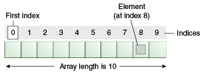

# Session 2

## Recap

In the previous session we covered the following:

- Git
- GitHub
- Software Development Life Cycle (overview)
- Software Development Life Cycle Models and Methodologies

---

## Variables

> When talking about variables in JavaScript, think of a box. Boxes come in different sizes, can store different volumes and can have different labels on them that describe the contents of that box.

Think variables, think storage spaces!


### What is a variable?

A variable is a name for a piece of memory that stores data.

When you declare a variable, you usually give that variable a type along with giving it a name but as JavaScript is an interpreted language, it is clever enough to work out what you are storing in the variable - :cool:

#### Declaring a variable

In JavaScript there are **three** ways to declare a variable.

##### 1. Var

The first is `var`. `var` is globally scoped. For example when we declare a variable using the `var` keyword, it is available across the whole of the code within that file.

```JavaScript
// creating a variable using the var keyword:
var myName = 8;

var goalsPerGame = 10;
```

For a while `var` was the only way we could declare a variable but thanks to ECMAScript 2016 (or ES6 which it is better known as), another two ways were introduced to improve the way we use variables (we'll compare them later).

:warning:&nbsp; When a variable is defined using `var` it can cause havoc when mistakedly or without knowledge, you try and declare another variable with the same name using `var`. We'll see this in action when we cover _Blocks and Scope_.

##### 2. Let

This is the modern, more preferred way of declaring variables in the JavaScript language. It was introduced in ECMAScript 2015 (i.e. ES6).

There is nothing to stop you using `var`, however, most organisations will have tools in place that will recommend (or insist) you convert your `var's` to `let's`.

```JavaScript
// creating a variable using the let keyword:

let firstName = 'Bob';

console.log(firstName);

let interestRate = 1.4;

firstName = 'John';
```

`Let` has a block level scope. We will cover this in a later session.

##### 3. Const

So far we have seen that we can re-assign a value to both `var` and `let`. However there may be times where we want to make a value remain assigned to a variable and not let the application change it's value. This is where `const` comes in (short for constant).

```JavaScript
const age = 39;

age = 31; // this will throw an error in the console. Try it!

console.log(age);
```

So when do we use a `let` or a `const`?

> Only use a const when you know the variable holding the value won't ever change. One simple example is declaring a `const` for PI. This an absolute number that won't change and everyone knows it's value.

> :thumbsup:&nbsp; In most cases, when people use `const` it's to hold a constant, i.e. a non changing variable, therefore they do tend to use capitals for the variable name with an underscore for each word

For example:

```JavaScript
const PI = 3.14;

const MAX_NUMBER_OF_PASSENGERS_ALLOWED = 1000;
```

However, there is nothing wrong with using just camel case for your `const` variables as well.

A positive to using `const` when needed is:

- it makes your code more robust
- it makes your code more secure
- less prone to error (we saw we got a warning as soon as we re-assigned a variable defined as a `const`)

:warning:&nbsp; When using `const` you **must** initialise it with a value otherwise you'll see an error in the console.

#### Comparison of variables

| Type  | Can be re-assigned a value | Global Scope | Block Level Scope |
| ----- | :------------------------: | :----------: | :---------------: |
| var   |             Y              |      Y       |         N         |
| let   |             Y              |      N       |         Y         |
| const |             Y              |      Y       |         Y         |


### Variables and case sensitivity

All variables you declare are case sensitive. For example, the variable declared as `firstAttempt` is NOT the same as a variable declared as `firstattempt`. This applies to all variables declared as `let` or `const` (we won't mention `var` as we want to forget them :wink: ).

### Best practices

When naming variables you must:

1. Ensure that the variable name used is **unique**. Remember, a variable called `student` is not the same as `STUDENT`. JavaScript is case sensitive when it comes to variable names.
2. Ensure that the variable is NOT a reserved keyword in the JavaScript language. To see the keywords refer to [this](https://developer.mozilla.org/en-US/docs/Web/JavaScript/Reference/Lexical_grammar#keywords) link.
3. Ensure that the variable starts with a character, `_` or an `&`.
4. Use **camel case** for your variable naming convention. First letter is lower case, then every subsequent word starts with a capital, i.e. numberOfPeople, oilInTheTank.
5. Do NOT use single letters for variable names! Just don't :anguished: - imagine trying to figure out and follow code that uses single letters for variables!
6. Variable names are case sensitive.
7. There are several [reserved words](https://developer.mozilla.org/en-US/docs/Web/JavaScript/Reference/Lexical_grammar#keywords) in JavaScript so ensure your variables are not using the same terms.

## To semi-colon or not to semi-colon? The big debate

You may have noticed that after every statement, there is a `;` added so far in the examples:

```JavaScript
let someVar;

let country = 'France';
```

You don't have to put a semi-colon after each statement but it's a good idea to do this as it clearly allows a developer to see the end of a statement.

For example, the following would still be intepreted by the JavaScript engine:

```JavaScript
let colour = 'red'
console.log(colour)

let animalsCount = 12
console.log(animalsCount)
```

In a small section of code, no semi-colons can be be fine but in a far more complex block it can make the eye play mind games!

:bookmark:&nbsp; It is best to check the code within your organisation to see the pattern adopted. They may have tools such as [ESLint](https://eslint.org/) that will ensure the semi-colon is added (or not), depending on the rules configured.

#### Initialising a variable

The process of declaring a variable as covered in the previous section is pretty straight forward. 

When declaring a variable the following check list should be considered:

- Declare a variable only when you need it. Save memory usage :wink:
- Determine the name for the variable that best represents the value you intend to hold inside it.
- As we we'll cover data types soon, determine the type of data type the value will be.
  
Once you have considered the above, you can then assign a value to the variable. You may decide to assign a _default_ value or not provide a value altogether.

For example:

```js
let numberOfStudents = 10; 
```

This initialises the `numberOfStudents` variable and **initialises** it with a value of 10 which is then stored in memory (where memory is allocated on the heap for the `numberOfStudents` variable).

However, if you do not initialise a variable but declare one for later usage, the initial value is not what you expect:

```js
let goalsScored;

console.log('Goals scored today', goalsScored);
```

As you will see, the value the is provisionally assigned to `goalsScored`, is `undefined`. This will be covered in the following section.

#### Difference between `var`, `let` and `const`

The difference between all three based on scope (we'll cover this later), hoisting and reassignment (you've seen how `let` and `const` can be reassigned):

| Keyword| Scope| Hoisting| Can Be Reassigned | Can be Redeclared |
| :--: |:--:|:--:|:--:|:--:|
|`var` | Function scope | Yes | Yes | Yes |
|`let` | Block scope | No | Yes | No |
|`var` | Block scope | No | No | No |

You may be wondering which of the three you should use in your own programs. A commonly accepted practice is to use `const` _as much as possible_, and `let` in the case of loops and reassignment. 

Generally, `var` can be avoided outside of working on legacy code (hopefully you won't need to work with `var`).

---

## Data Types

> We all know that everything around us has some context and we can relate those objects to a particular type. For example, age, is known as a number. Date of birth as a date, whether it's raining outside could be expressed a yes/no etc.

In programming there are two types of data types:

- Statically typed: The data type is known an compile time and the variable can only hold the value for that given data type. This is evident in say Java.
- Dynamically typed: This is where the variable can hold any data type and the interpreter/compiler can figure it out, this is JavaScript.

In JavaScript there are several _primitive_ types, i.e. the data types are directly assigned to memory (i.e. they have their own defined space that they use).

### Strings

String is a data type used to represent text. Simple as that.

For example:

```JavaScript
let message = 'This is a message';
console.log(message);

let anotherMessage = "This is another message";
console.log(anotherMessage);
```

As you can see, both examples declare a variable and initialise it with some text. One with single quotes, the other with double. **There is no difference between the two types when used**.

> :thumbsup:&nbsp; It is good practice to sticking to one type of quote, ideally the single quote when declaring a String variable.

There is however, another way of initialising a String variable:

```JavaScript
// using back ticks
let text = `This is some text using back ticks`;
console.log(text);
```

Back ticks can also be used and was introduced in ES6. This has a much more powerful usage, for example they can be used to embed variables and expressions by wrapping them inside the following characters `${}`. Back ticks are also referred to as being a complex string and the actual process of using back ticks are referred to as `Template Literals`.

For example:

```JavaScript
let firstName = 'John';
let age = 12;

// we have replaced the ${variableName} placeholder with their values:
let message = `${firstName} is ${age} years old`;
console.log(message);

// this is an expression example:
let total = `${2 + 2}`;
console.log(total); // displays 4

// what the previous example does is stop us from doing this old (ugly) way of concatenation:
let anotherMessage = firstName + ' is ' + age + ' years old';
```

You can also use `template literals` by wrapping multiple lines for example:

```js
let message = `This is a long 
message about how to use template literals.

Template literals are cool!
`
```

This example will allow for newlines to be kept in place when you print the variable `message` to the console output.

So when to use quotes and when to use back ticks? Well the answer is simple:

> When you want to do something dynamic with the text, use back ticks, otherwise use single quotes.

#### Strings are immutable - i.e. they cannot be changed

When creating a variable as a string, you can re-assign a value but you cannot change the representation of a character in a string, for example:

```JavaScript
let name = 'John';
console.log(name[0]); // we can access the first letter - this will print 'J' to the console output

name[0] = 'K'; // attempt to change the first letter to 'K':

console.log(name[0]); // hmm, we still get 'J'
```

The notation of using square brackets is covered at length when we look at `Arrays` in the upcoming content but in short, they allow you to access a part of a data structure by it's index.

#### String methods

The String _primitive_ type has several **built-in** methods. In this section we will cover the most used String methods that are available to use.

##### Length

You can obtain the length of a string using the built-in property `length`:

```js
const name = 'John Doe';

console.log('Length of name', name.length);
```

NOTE: Looking for any method on a string that is null or undefined will result in an error!

##### Substring

There may be occasions where you would like to obtain part of a string. You can do this using the `substring` built-in method. 

The signature of the `substring` method is:

```
substring(indexStart)

or

substring(indexStart, indexEnd)
```

... where `indexStart` and `indexEnd` refer to the character position in the string.

For example:

```js
let browser = 'Chrome';

console.log(browser.substring(0, 2)); // this will yield 'Ch'

console.log(browser.substring(2)); // this will yield 'rome'
```

The signature that only takes the `indexEnd` basically says, take the characters beyond this index and after.

NOTE: There is also a `substr` method but this has been _deprecated_ due to browser support. Therefore use the `substring` method instead.

<div style="text-align: left; padding: 20px 10px; border: 1px solid silver; margin-bottom: 15px;">

<div style="margin-top: -60px; margin-left: 75px;">
<p>Challenge: Substring</p>

Given the following strings, find the middle two characters:

'string'
'code'
'Practice'

</div>
</div>

We will go through some coding challenges later in the bootcamp where you may decide to use this method.

##### Index Of

We may from time to time want to know if a certain character exists within a string. A common example may be to check if the '@' symbol exists for instance in a variable that is meant to hold an email address. To achieve this, we can use the `indexOf` method.

The signature of the `indexOf` method is:

```
indexOf(searchString)

or

indexOf(searchString, position)
```

To verify such variable, we can use the `indexOf` method:

```js
let emailAddress = 'johndoe@somewhere.com';

console.log(`Does @ exist in the email address?`, emailAddress.indexOf('@'));
```

If character or sequence of characters exist in the target string, the index of the first instance is returned meaning a 0 or greater number. 

If there is no match, then `-1` is returned to denote that no match was found.

For example, checking if a message contains a comma:

```js
let message = 'This is a simple message';

console.log(`A comma should not exist`, message.indexOf(',')); // this will yield -1
```

An example of the second version `indexOf(searchString, position)` is used when you want to find the position of a certain sequence beyond the first time it is found:

```js
const paragraph = 'The quick brown fox jumps over the lazy dog. If the dog barked, was it really lazy?';

const searchTerm = 'dog';
const indexOfFirst = paragraph.indexOf(searchTerm);

console.log(`The index of the first "${searchTerm}" from the beginning is ${indexOfFirst}`);
// expected output: "The index of the first "dog" from the beginning is 40"

console.log(`The index of the 2nd "${searchTerm}" is ${paragraph.indexOf(searchTerm, (indexOfFirst + 1))}`);
// expected output: "The index of the 2nd "dog" is 52"

```

We will go through some coding challenges later in the bootcamp where you may decide to use this method.

##### Last Index Of

You may also want to know the location of a character, specifically the last position of the character. To do so you can use the `lastIndexOf` method.

The signature of the `lastIndexOf` method is:

```
lastIndexOf(searchString)

or

lastIndexOf(searchString, position)
```

A common example of this being use may be to extract the file extension for a given file:

```js
let filename = 'my-word-document.doc';
const indexOfPeriod = filename.lastIndexOf('.')

console.log(filename.substring(indexOfPeriod)); // will give you 'doc'.
```

You can also put both method calls on the same line:

```js
let filename = 'my-word-document.doc';
console.log(filename.substring(filename.lastIndexOf('.'))); // will give you 'doc'.
```

##### Replace

There may be occassions where you would need to replace certain characters in a string. Luckily there is a `replace` method built-in.

The signature of the `replace` method is:

```
replace(regexp, newSubstr)

or 

replace(substr, newSubstr)
```

The first argument is a regular expression (don't worry for now about this as we'll cover this properly at some stage in the bootcamp), the second argument is then the string you want to use as the replacement.

For example:

```js
const phrase = 'The quick brown fox jumps over the lazy dog. If the dog reacted, was it really lazy?';

console.log(phrase.replace('dog', 'monkey'));
// expected output: "The quick brown fox jumps over the lazy monkey. If the dog reacted, was it really lazy?"


const regex = /Dog/i;
console.log(phrase.replace(regex, 'ferret'));
// expected output: "The quick brown fox jumps over the lazy ferret. If the dog reacted, was it really lazy?"
```

##### Replace All

Where the previous `replace` replaces a single appearance in a string, you may want to replace **all** instances in a string. To do so we can use the `replaceAll` method.

The signature of the `replaceAll` method is:

```
replaceAll(regexp, newSubstr)

or

replaceAll(substr, newSubstr)
```

To utilise the `replaceAll` method, we can do this:

```js
const phrase = 'The quick brown fox jumps over the lazy dog. If the dog reacted, was it really lazy?';

console.log(phrase.replaceAll('dog', 'monkey'));
// expected output: "The quick brown fox jumps over the lazy monkey. If the monkey reacted, was it really lazy?"

// global flag required when calling replaceAll with regex
const regex = /Dog/ig;
console.log(phrase.replaceAll(regex, 'ferret'));
```

** This method is not supported in Internet Explorer browsers.

##### Slice

Slice it! We may want to extract parts of a string without modifying the original. To do so, we can take a chunk or a slice of the original string using the `slice` method.

The signature of the `slice` method is:

```
slice(beginIndex)

or

slice(beginIndex, endIndex)
```

For example:

```js
const str = 'The quick brown fox jumps over the lazy dog.';

console.log(str.slice(31));
// expected output: "the lazy dog."

console.log(str.slice(4, 19));
// expected output: "quick brown fox"

console.log(str.slice(-4));
// expected output: "dog."

console.log(str.slice(-9, -5));
// expected output: "lazy"
```

You may be wondering "isn't this the same as substring?" .... not quite.

If you look at the last example and especially the last console commands:

```js
const str = 'The quick brown fox jumps over the lazy dog.';

console.log(str.slice(-4));
// expected output: "dog."
```

The `slice` method wraps around the string from the first character as position `0` all the way around to the end, therefore a `-4` yields `dog.`. Basically `slice` allows for negative indices, whereas `substring` does not.

##### Uppercase

Coming to some straight forward methods, to make a string appear in capital letters, you can use `toUpperCase` method on a string.

To capitalise a string simply do the following on a String variable:

```js
let name = `john doe`

console.log(name.toUpperCase()); // this will print JOHN DOE
```

##### Lowercase

To make a string appear in lower-cased letters, you can use `toLowerCase` method on a string.

Simply do the following on a String variable:

```js
let name = `JOHN DOE`

console.log(name.toLowerCase()); // this will print JOHN DOE
```

Both of these operations of changing case are useful when you want to perform case insensivite checks against variable values. For example checking if a username is correct, you can turn it all in lower case if you are trying to match it against a value stored in a database (as lower case).

##### Splitting

A string may require you to split it into parts based on a character or a set of characters. You can do this using the built-in `split` method on a String.

The signature of the `split` method is:

```
split()

or

split(separator)

or

split(separator, limit)
```

Here the `separator` can be a single character, a space, tab or a combination of them all (via a regular expression).

When you use `split` on a String, the result you get is a data structure, an Array! (we will look at Arrays in the next section).

For example:

```js
const str = 'The quick brown fox jumps over the lazy dog.';

const words = str.split(' ');

console.log(words); // this will show you the Array contents

console.log(words[3]);
// expected output: "fox"

const chars = str.split('');
console.log(chars[8]);
// expected output: "k"
```

As we have seen before, we can access each part of the partitioned string using an index, so in this example, an index of 3 and 8 have been used.

If you wanted for example, to split a String variable on every character, you can use the `''` separator:

```js
const alphabet = 'abcdefghijklmnopqrstuvwxyz';

console.log(alphabet.split('')); // this will put each letter into the Array
```

There are several more methods on Strings that you can use so refer to [this](https://devdocs.io/javascript/global_objects/string) guide for further details and examples.

### Numbers

In JavaScript, you can define a number as a whole number, negative number or as a decimal. 

There is nothing too tricky when using numbers but what is important is the name and value for the variable should correlate to make it easier to know what someone is dealing with.

As with Strings, there is a data type that can cater for numbers and it's called _Number_.

Number is a primitive wrapper object used to represent and manipulate numbers like 37 or -9.25.

The JavaScript Number type is a double-precision 64-bit binary format IEEE 754 value, like double in Java or C#. This means it can represent fractional values, but there are some limits to what it can store. A Number only keeps about 17 decimal places of precision; arithmetic is subject to rounding. The largest value a Number can hold is about 1.8E308. Values higher than that are replaced with the special Number constant Infinity.

A number literal like 37 in JavaScript code is a floating-point value, not an integer. There is no separate integer type in common everyday use. (JavaScript now has a BigInt type, but it was not designed to replace Number for everyday uses. 37 is still a Number, not a BigInt.)

A set of example of literal representation of a number can be seen as:

```JavaScript
// decimal but still a number:
let interestToApply = 2.3;
console.log(interestToApply);

let weightInLbs = 230;
console.log(weightInLbs);

let temperature = -3;
console.log(temperature);
```

However, the same can be done using the _Number_ data type:

```js
Number('123')  // returns the number 123
Number('-5')  // returns the number -5
```

The useful thing about using the Number data type is that is provides some useful methods that we can make use within our logic.

#### Is Integer

We may want to check if a given variable is an integer, i.e. a whole number. We can achieve this by using the `isInteger` method on the Number data type:

```js

console.log(Number.isInteger(99)); // true

console.log(Number.isInteger('a')); // false
```

#### Is Not a Number

We can also check if a value provided is actually a number or not using the built-in method, `isNaN`. For this we do not need to prefix it with `Number.` as it has existed in the JavaScript specification for quite some time:

```js
console.log(isNaN(9)); // false

console.log(isNaN('a')); // true
```

#### Converting a String to an integer

We can convert a string to an integer quite easily using the built-in method `parseInt`. Like `isNaN`, we do not need to prefix `parseInt` with anything as it has existed for a while:

For example:

```js
let numberOfItems = '10'

let numberOfItemsAsNumber = parseInt(numberOfItems);
console.log('Items as a number variable', numberOfItemsAsNumber);
```

This can be useful when you come to comparing values later.

#### Converting a String to a float/decimal

We can convert a string to a float/decimal quite easily using the built-in method `parseFloat`. Like `parseInt`, we do not need to prefix `parseFloat` with anything as it has existed for a while:

For example:

```js
let radius = 4.5;
let circumference = parseFloat(radius) * 2.0 * Math.PI;

console.log('circumference as a float', circumference);
```

This can be useful when you come to comparing values later.

### Booleans

In all programming language we also have a data type that is either `true` or `false`. This is known as a boolean.

In JavaScript you can assign a boolean to any type of variable:

```JavaScript
const APPLY_SALARY_INCREASE = true;
console.log(APPLY_SALARY_INCREASE);

let isRainingToday = true;
console.log(isRainingToday);

let hasReachedLimit = false;
console.log(hasReachedLimit);
```

Booleans are very useful when we need to make decisions and control the flow of our applications. We will cover conditionals in later sessions.

:warning:&nbsp; A key point compared to some other languages that if you declare a variable deeming it to hold a boolean, it will remain as `undefined` whereas in strongly typed languages, like Java for example, a variable defined of type boolean, will have a default value of `false`.

An alternative to the boolean outcomes:

| Boolean |          AKA           |
| :-----: | :--------------------: |
| `true`  | correct, yes, Y, y, 1  |
| `false` | incorrect, no, N, n, 0 |

### Null

This data type let's us define a variable that holds **nothing**. It's just an empty box! `null` is a special type of object in JavaScript. it's the langauges way of saying there's nothing inside!

```JavaScript
let response = null;
```

Here we can check the `response` variable to see if it is `null` or not and continue processing if we wish. We'll cover `null` and it's usage in future sessions.

### Undefined

This refers to a variable that has not been assigned any value but is merely declared. For example:

```JavaScript
let numberOfStudents;

console.log(numberOfStudents); // this will print 'undefined' when rendered in the console
```

You can also explicitly assign `undefined` to a variable:

```JavaScript
let someVar = undefined;
```

### Truthy vs Falsy

**This is specific to JavaScript (it can also apply to Python)**

#### Truthy

In JavaScript, a truthy value is a value that is considered true when encountered in a Boolean context. All values are truthy unless they are defined as falsy. That is, all values are truthy except false, 0, -0, 0n, "", null, undefined, and NaN.

#### Falsy

A falsy (sometimes written falsey) value is a value that is considered false when encountered in a Boolean context.

A falsy value can be seen as one of: `false`, `0`, `-0`, `0n`, `""`, `''`, ``, `null`, `undefined` or `NaN`.

Further reading can be done [here](https://www.sitepoint.com/javascript-truthy-falsy/).

### Objects

One of the most important Data Types within the language when it comes to modern JavaScript are Objects. We will be using Objects alot in this bootcamp.

Objects are used to store multiple data types. They are referred to as a referenced data type. They are not primitive as such as the memory allocated to an Object in JavaScript is dynamically defined.

> Objects in simple terms are used to group different variables

Examples of an Object in JavaScript are:

```JavaScript
const name = 'John';
const age = 25;

// on their own they have no relation to one another, however we can create a person object:

const person = {
    name: 'John',
    age: 25
};

console.log(person);
```

As you can see, we have **encapsulated** both _name_ and _age_ within an object.

Whenever you want to create an object, you simple use `{}` and within them you define key-value pairs separated with a `:` (colon) and each property is separated by a comma (`,`).

In the example we have used, you can start to see how useful this could be.

So how do we access the `name` and `age` from the `person` object?

```JavaScript
const person = {
    name: 'John',
    age: 25
};

// we use the dot notation to extract each property:
console.log(person.name);
console.log(person.age);

// let's check the types of the person and properties:
console.log(typeof person);
console.log(typeof person.name);
```

As you can see, an object can contain any data type and data structure (Arrays) - very useful :ok_hand:

We will revisit Objects later in the bootcamp and look at them in greater depth.

---

### Date

Another member of the object family is `Date`.

In JavaScript we can obtain the date by using the `Date` object data type:

```JavaScript
const now = new Date();
console.log(now);
```

The `Date` has several useful functions available - we'll visit some of these in later sessions.

---

### Data Structures: Arrays

In JavaScript we also have data structures that allow us to store different values inside a variable.

Like Objects, Arrays are also reference types in that when they are created as a variable, they are dynamic in nature in the sense that they do not have a fixed size. They can grow or shrink in terms of their contents but the location in memory remains the same.

Creating an Array is a simple case of using `[]` and assigning this to a variable:

```js
const people = []; // this initialises an empty array with 0 elements.
```

Each value you place inside an Array is referred to as an element.

#### Anatonmy of an Array



An array is made up of zero to many elements. You can think of an element as a cell in a spreadsheet. As mentioned before, the first element starts at index `0` and sequentially increases as you move along the positions.

For example:

```js
const countries = [ 'France', 'Germany', 'Poland' ]; // declares an array holding 3 strings
console.log(countries);

const lotteryNumbers = [9, 23, 44, 12, 8, 34]; // declared an array holding only numbers
console.log(lotteryNumbers);
```

As you can see, an Array can hold any data type value therefore is dynamic by nature and in action!

The following can also happen, unlike in other languages, an Array of mixed data types:

```js
const mixedArr = ['John', 12, 3.14, true]; // mixed bag of types but valid!
```

:exclamation:&nbsp;However, it is best **not** to do this as it would cause endless pain for the person that has to then determine what each value's data type is!

> :exclamation:&nbsp;Arrays retain their element insertion order. If you insert elements they stay at that position unless changed manually.

### Multi-Dimensional Arrays

We can further expand our arrays in JavaScript by declaring a 2D array:

```JavaScript
// here we have an array within an array
const nameGenderArr = [['John', 'M'], ['Sue', 'F'], ['Paul', 'M']];

console.log(nameGenderArr);
```

This becomes an Arrray of Arrays.

### Accessing Items in an Array

Arrays in JavaScript are **zero-indexed** (I've not come across a language where this rule is not true so it can also be treated for other languages as well).

Each item in an array is referred to as an _element_. To access an element inside an array you use the `[]` brackets and add an index.

To access say the _first_ element in an array:

```JavaScript
const numbers = [9, 7, 33, 88];

console.log(numbers[0]); // first is 0, zero-based
```

To access the third element:

```js
console.log(numbers[2]); // third
```

What about the multi-dimensional Array?

```js
const nameGenderArr = [['John', 'M'], ['Sue', 'F'], ['Paul', 'M']];

console.log(nameGenderArr[0]); // will return ['John', 'M']
console.log(nameGenderArr[1]); // will return ['Sue', 'F'']

console.log(nameGenderArr[0][0]); // will return 'John'
```

## Array of Objects

Most of the time you will be dealing with array of objects when working with JavaScript. For example you may receive an array of objects from some back end application.

To demonstrate, let's create an array of objects:

```js
const todos = [
    {
        id: 1,
        text: 'Put bins out',
        isCompleted: true
    },
    {
        id: 2,
        text: 'Go to dentist',
        isCompleted: false
    },
    {
        id: 3,
        text: 'Brush teeth',
        isCompleted: true
    }
];

// we can console log this:
console.log(todos);

// we can also print a particular object property as we have seen previously:
console.log(todos[0].text); // Put bins out
```

## Array methods

As with Strings and numbers, there are a host of useful methods that an array gives us out of the box. In this section we will cover a few of them and the remainder will be covered in upcoming sessions.

### Determining the length of an array

A straightforward method to obtain the current length of an array is called .... drumroll .... `length`.

To obtain the length of an array (assuming it has been initialised (holds a value other than null or undefined):

```js
const countries = ['France', 'Brazil'];

console.log(countries.length); // this returns 2.
```

If trying to obtain the length of an array that hasn't been initialised you will be faced with an error so be careful. There is a way around this which we will look at in upcoming sessions.

### Pushing items onto an array

One method that we can use on an array is the `push` method which can be used on any variable that has been initialised as an Array.

When using the `push` method, it allows the user to add an element _to the end of an array_. For example:

```js
const names = [ 'Bob' ];

names.push('Jill');

// this will now have Bob and Jill in the Array
```

### Removing items from an array

Another method that we can use on an array is the `pop` method which can be used on any variable that has been initialised as an Array.

When using the `pop` method, it allows the user to remove an element _from the end of an array_. For example:

```js
const names = [ 'Bob', 'Jill' ];

names.pop();

// this will now leave just 'Bob'
```

You can also store the value that has been removed from the Array by assigning the output to a variable:

```js
const numbers = [ 1,2,3 ];

const lastRemovedNumber = numbers.pop();

console.log('Numbers', numbers, 'Last Removed', lastRemovedNumber);
```

### Adding an element at a particular index

You may want to perhaps, add an element to an Array at a particular position. Thankfully there is a method built-in for this called, `splice`.

The signature of the `splice` method is:

```
splice(start)
splice(start, deleteCount)
splice(start, deleteCount, item1)
splice(start, deleteCount, item1, item2, itemN)
```

To add say a month to an array of months at index 1 we can do this:

```js
const months = ['Jan', 'March', 'April', 'June'];
months.splice(1, 0, 'Feb');
// inserts at index 1
```

If you intend on adding an element, then you need to make sure that the `deleteCount` argument is set to `0` otherwise you'll get the wrong result (you'll end up deleting elements :cry:&nbsp;)

So in the example above, we intended to add 'Feb' at position 1 (i.e. the second element), without removing anything, with the value for 'Feb'.

### Removing an element from a particular position

You guessed it :D&nbsp; we can use `splice` again. It's like our swiss army knife for Arrays!

To remove an element from a given index we can do the following:

```js
const months = ['Jan', 'March', 'April', 'June'];
months.splice(1, 1);
// Removes March
```

where the first index is the position to target and the second is the number of elements from _that_ position to delete from.

### Replacing an element at a particular position

You can also replace an element at a given position. Although `splice` provides this function as well, you can also directly update an Array element using it's index.

To replace an existing element in an Array:

```js
const months = ['Jan', 'Feb', 'March', 'April', 'June'];
console.log(months);

months.splice(4, 1, 'May');
// replaces 1 element at index 4
```

### Removing the first element of an Array

Although we have used `pop` this removes the last inserted element. But what if we wanted to remove the very first element to be added to an Array? We can use the `shift` method.

To remove the first element we can do this:

```js
const numbers = [1, 2, 3];

const firstNumberAdded = numbers.shift();

console.log(firstNumberAdded);
// expected output: Array [2, 3]
```

The caveat of the `shift` method is it also _returns_ the element that has been removed.

### Adding elements to the start of an Array

We have seen that we can use the `push` method and the `splice` method to add elements to the end or to a specific area of an Array, however what if we didn't want to mess around with using indexes (i.e. if we used `splice`)? Well we can make use of the `unshift` method which allows to add 1 or more elements at once to the **beginning** of an array and at the same time, tell us the new length of an array:

```js
const numbers = [1, 2, 3];

console.log(numbers.unshift(4, 5));
// expected output: 5

console.log(numbers);
// expected output: Array [4, 5, 1, 2, 3]
```

### Merging elements in an array to form a string

There may be an occasion where you may want to join elements in an array to say form a new variable which is a String. For example, let's say a national insurance number which may be presented to us as an array of each part of the number itself.

To do so we can make use of the `join` method which takes may or may not take a separator.

The signature of the join method is:

```
join()

or 

join(separator)
```

When no separator is provided, a `comma` is used as the joining character.

An example is as follows:

```js
const nationalInsuranceNumberArray = ['GH', '34', '90', '34', 'D'];

// if we wanted this to be a joined string:
const nationalInsuranceNumber = nationalInsuranceNumberArray.join(); // this will be 'GH,34,90,34,D'
console.log('nationalInsuranceNumber', nationalInsuranceNumber);

const nationalInsuranceNumberWithHyphens = nationalInsuranceNumberArray.join('-'); // this will be 'GH-34-90-34-D'
console.log('nationalInsuranceNumberWithHyphens', nationalInsuranceNumberWithHyphens);
```

You can see value in this if you for exampee received a date of birth in an array and had to present it as a string.

### Reversing an array of elements

To reserve an array's elements, i.e. the last becomes the first element and vice versa, you can make use of the `reverse` method.

The `reverse` method returns a reversed reference of the array. This is key to remember when we ctak about mutation (we will look at mutation in upcoming sessions so don't worry what this means other than simply, the same array is changed rather a new copy being created).

```js
const array1 = ['one', 'two', 'three'];
console.log('array1:', array1);
// expected output: "array1:" Array ["one", "two", "three"]

const reversed = array1.reverse();
console.log('reversed:', reversed);
// expected output: "reversed:" Array ["three", "two", "one"]
```

### Finding the position of an element

Just like with string variables, an array also has a means of finding the index of a element.

To find an index for an element, you can use the `indexOf` method:

```js
const beasts = ['ant', 'bison', 'camel', 'duck', 'bison'];

console.log(beasts.indexOf('bison'));
// expected output: 1
```

This is useful if you know an element exists in an array. If the element does not exist a value of `-1` is returned.

For searching an array there are more powerful methods built-in that we'll visit in upcoming sessions for to prevent brain freeze we'll stop here.

### Joining multiple arrays together

We can make use of the `concat` method of an array that allows us to join arrays together to form a new array:

For example:

```js
const array1 = ['a', 'b', 'c'];
const array2
 = ['d', 'e', 'f'];
const array3 = array1.concat(array2);

console.log(array3);
// expected output: Array ["a", "b", "c", "d", "e", "f"]
```

### Sorting an array

The `sort` method on an array allows us to natrually order an array. 

For example:

```js
const months = ['March', 'Jan', 'Feb', 'Dec'];
months.sort();
console.log(months);
// expected output: Array ["Dec", "Feb", "Jan", "March"]

const array1 = [1, 30, 4, 21, 100000];
array1.sort();
console.log(array1);
// expected output: Array [1, 100000, 21, 30, 4]
```

### Determining if an element exists in an array

Like the `indexOf` method that tells us the possible index of an element, we may want to simply use a `true` or `false` outcome to determine if an element exists in an array (rather than using the `-1` check).

To do this we can use the `includes` method:

```js
const fruits = ['banana', 'apple', 'pear'];

console.log('Contains oranges?', fruits.includes('oranges')); // false

console.log('Contains oranges?', fruits.includes('apple')); // true
```

A key aspect of `includes` is it does an exact match on the item being passed in therefore case matters as does the data type.

There are more sophisticated ways of sorting an array which we will look at in upcoming sessions.

> There are a whole lot more other useful and powerful methods on an array that we will visit in upcoming sessions but for now the ones mentioned should suffice.
> For further method information on Arrays, visit [this](https://developer.mozilla.org/en-US/docs/Web/JavaScript/Reference/Global_Objects/Array) page.


<div style="text-align: left; padding: 20px 10px; border: 1px solid silver; margin: 30px 0px;">

<div style="margin-top: -60px; margin-left: 75px;">
<p>Challenge: Zoo Trip (Chaos?)</p>

A bus containing the following children has set of on a zoo trip. The order of where the children have been asked to initially sit in the bus is represented by the following Array structure where the back of the bus is the first element (i.e. the left most):

Ryan, Brandon, Rebecca, Richard, Jessica, Brian, Antoinne, Grace, Zee, Ibrahim

Issue 1:

On route, Ibrahim feels unwell and ask if he can sit at the back of the bus so he can lie down on the back bench

Re-arrange the array to fulfill this request and return it as a new array.

Issue 2:

Rebecca is being a nuisance on the trip constantly singing which is upsetting the rest. To resolve this, she's best sat at the front of the bus.

Re-arrange the array to fulfill this request and return it as a new array, keeping the previous condition in mind.

Issue 3:

Richard and Antoinne are best friends and are talking loudly across the bus which is disturbing Jessica and Brian. The teacher has decided it's best to move them Richard to sit behind Antoinne.

Re-arrange the array to fulfill this request and return it as a new array, keeping the previous conditions in mind.

Issue 4:

The children have finally arrived! However Ryan has special needs and the teacher thinks he's best at the front where he can be supervised and enjoy the trip more. However, Rebecca must remain right at the front.

Re-arrange the array to fulfill this request and return it as a new array, keeping the previous conditions in mind.

</div>
</div>

---

### Data Structures: Set

In newer versions of Javascript, they introduced a new data structure which is called a `Set`. 

A Set is another reference type in that it's memory location is dynamic (organically grows).

What is a Set? 

> A Set object lets us store **unique** values of **any** type whether theiy are of the _primitive_ or _object reference_ nature.

They become handy when you want to say remove duplicates from an Array. Instead of looping around the Array to remove duplicates, you can simple add the Array elements to a `Set` and it will do the sifting for you!

#### Creating a Set

Let's see how we create one and see it in action:

```js
const mySet1 = new Set()

mySet1.add(1)           // Set [ 1 ]
mySet1.add(5)           // Set [ 1, 5 ]
mySet1.add(5)           // Set [ 1, 5 ]
mySet1.add('some text') // Set [ 1, 5, 'some text' ]
```

#### Checking if a set contains a value

We can verify a Set contains a value using a helpful method `has` method:

```js
const mySet1 = new Set()

mySet1.add(1)           // Set [ 1 ]
mySet1.add(5)           // Set [ 1, 5 ]

console.log(mySet1.has(1)); // this will return true
console.log(mySet1.has(9)); // this will return false
```

:exclamation:  The insertion order of a Set is not retained unlike an Array.

There are other useful Set methods but for brevity we will not cover them in the bootcamp as we can focus more on Arrays. If you want to read more about Sets, visit [this](https://developer.mozilla.org/en-US/docs/Web/JavaScript/Reference/Global_Objects/Set) page.

---

### Data Structures: Map

Finally another data structure that exists in Javascript is `Map`.

A `Map` object holds key-value pairs and remembers hhe original insertion order of the _keys_. As with `Set` and `Array`, any _primitive_ and _non-primitive_ values can be stored in a `Map`.

This is how we initialise and use a `Map`:

```js
const map1 = new Map();

map1.set('a', 1);
map1.set('b', 2);
map1.set('c', 3);

console.log(map1.get('a'));
// expected output: 1

map1.set('a', 97);
// expected output: 97
```

As you can see to add a key pair, you use the `set` method on the Map. This adds a key-value pair.

#### Checking if a Map contains a value

Similar to the `Set`, the `Map` object has a `has` method but the difference is that we need to use the **key** to determine if the key-value pair exists:

```js
const map1 = new Map();
map1.set('bar', 'foo');

console.log(map1.has('bar'));
// expected output: true

console.log(map1.has('baz'));
// expected output: false

```

There are other useful Map methods but for brevity we will not cover them in the bootcamp as we can focus more on Arrays. If you want to read more about Maps, visit [this](https://developer.mozilla.org/en-US/docs/Web/JavaScript/Reference/Global_Objects/Map) page.

There are other data structures in other languages (some in JavaScript have to be created where as in other languages they pre-exist):

- Queues
- Linked Lists
- Lists

:book: &nbsp;For further reading about data structures, you can visit [this](https://towardsdatascience.com/8-common-data-structures-every-programmer-must-know-171acf6a1a42) page.