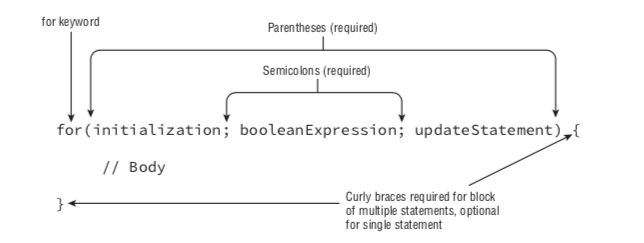
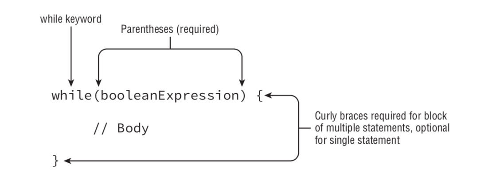
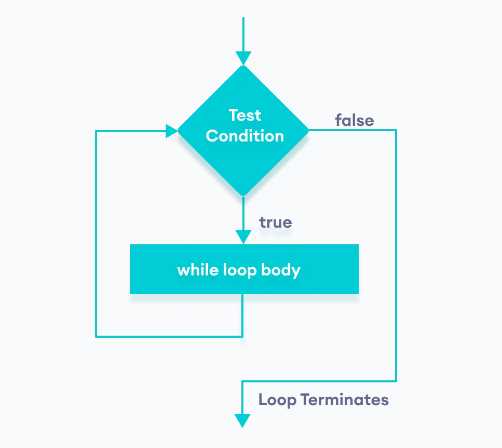
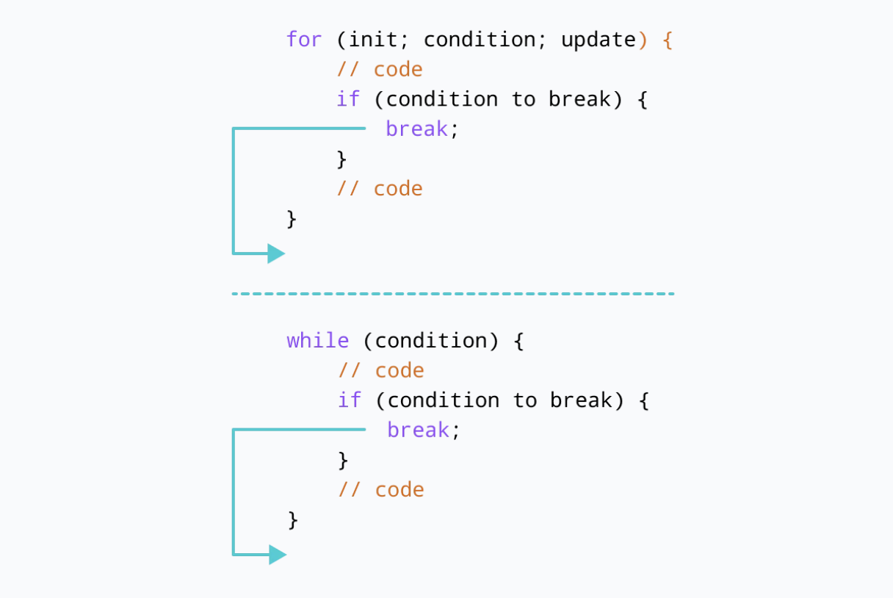
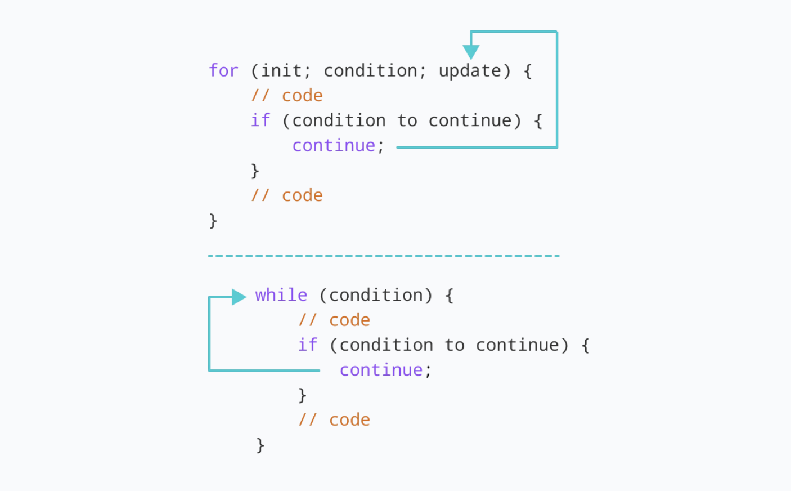

# Session 3

## Recap

In the previous session we covered the following:

- Variables: How to declare and initialise them
- Data Types: the various types and their possible values
- Data Structures: We covered Arrays, Sets and Maps.

---

## Operators

There will be times where you'll come across **Operators**.

By Operators I don't mean mobile operators.

When using operators, you use one or many **operands** in so to speak and for demonstration purposes I'll add some logic to show you all of the ones you'll use.

:running: We'll shoot through this section as the operators are pretty bog standard!

:exclamation: It is assumed you know standard [BODMAS](https://www.mathsisfun.com/operation-order-bodmas.html).

### Addition

To add two numbers together we use the `+`:

```JavaScript
let number1 = 10;
let number2 = 20;

let result = number1 + number2;

// or

let anotherResult = 1 + 4;
```

:warning: One thing to note, the `+` symbol also has a different mean when you start to use string variables with numbers - it turns into a way to _concatenate_ so be careful when using it:

```JavaScript
let firstName = 'John';
let age = 23;

let result firstName + age; // this will be John23
console.log(result);
```

This is one of the reasons why they introduced the back ticks to prevent this ugly scenario and mistake which can happen without you knowing!

### Subtraction

To subtract number we use the `-` symbol:

```JavaScript
let result = 5 - 3; // 2
```

It can be used with decimals and whole numbers (positive and negative).

### Multiplication

To multiply numbers, we use the `*` (asterisk) symbol:

```JavaScript
let result = 5 * 5; // 25
```

### Division

To divide numbers we use the `/` (forward slash) symbol:

```JavaScript
let result = 10 / 2; // 5
```

### Remainder/Modulus

To find the remaining value when another number is removed from the original, we use the modulus symbol (%):

```JavaScript
let result = 10 % 3; // 1 because three 3's fit into 10 only leaving a remainder of 1
```

### Increment

When we want to move up by one we use the increment symbol `++`:

```JavaScript
let start = 0;

// we can increment
start++; // now the value is 1
```

#### Pre-Increment Vs Post-Increment

There are two forms of incrementing, one is `pre` where we place the `++` before the variable and the other is `post` where we place the `++` after the variable. So why do we have two and what's the difference?

> Using `i` as our variable ...
>
> pre-increment (++i) adds one to the value of i, then returns i; in contrast, i++ returns i then adds one to it, which in theory results in the creation of a temporary variable storing the value of i before the increment operation was applied

### Decrement

When we want to move down by one we use the decrement symbol `--`. This is usually used when we want to go in reverse order:

```JavaScript
let start = 0;

// we can increment
start--; // now the value is 1
```

#### Pre-Decrement Vs Post-Decrement

Again for _decrementing_, they follow the same rules for the placement of the `--` symbol.

### Abbreviated Operators

When we want to use any of the operators (except the increment, decrement ones), to perform an action on the same variable, we just apply the operator and the value we want to change it by:

```JavaScript
let number = 0;

number = number + 3; // this adds 3 to 0
```

However we can abbreviate this:

```JavaScript
let number = 0;

number += 3; // this adds 3 to 0 -  which says add 3 to the same variable
```

The abbreviation form **can only be used on a pre initialised variable** so the following cannot be done:

```JavaScript
let number += 3; // this will give you an interpreter error!
```

:bookmark: You can use any operator in the abbreviated form: `+`, `-`, `%`, `*`, `/`.

When using the short hand format, this is also referred to as being a **compound operator**.

### Equals Operator

Now one of the funny operators when it comes to JavaScript is the equals operator.

For a while now the equals operator has been `==`, for example:

```JavaScript
let number1 = 10;
let number2 = 10;

let result = number1 == number2;
console.log(result);
```

Now although the `==` is fine to use, this only checks the value and performs magic when using mixed data types. For example, say we have:

```JavaScript
let mobileNumber = 447980099876;
let alternativeMobileNumber = '447980099876';

let result = mobileNumber == alternativeMobileNumber;
console.log(result);
```

By using the `==` symbol, JavaScript tries it's best to try and covert both variables to a common data type so they can be compared. Which way it was converted? Well that's down to the interpreter!

In JavaScript ES6 (I think), they introduced the strict equality check

### Strict Equality Operator

This operator uses the following symbols `===`. Yes, that's three equal signs :grin:

What this does is ensures that the check being made is for the **same** data type and value, so our previous example should now return `false` in the console window:

```JavaScript
let mobileNumber = 447980099876;
let alternativeMobileNumber = '447980099876';

let result = mobileNumber === alternativeMobileNumber;
console.log(result);
```

:bookmark: The more you use JavaScript, the more you **should prefer** to use the `===` operator as it is much more **secure** and makes your applications more **robust**.

> For the remainder of the sessions, we will use `===` as required.

### NOT Operator

```JavaScript
let topScore = 20;
let result = topScore !== 10;

console.log(result);
```

Now we have situations where we look for the negative outcome for a result. This is where we use the NOT operator, `!==`. From the previous section, the NOT operator uses an exclamation mark before the first equal symbol but the rest is the same as the `strict equality check`. Here, it is still doing the `strict equality check` but for a negative scenario.

### Greater Than Operator

The next operator is the greater than which represented by the `>` symbol.

```JavaScript
let number = 20;
let result = number > 30;

console.log(result);
```

### Greater Than and Equal To Operator

This operator is represented by the `>=` symbol. You write it as you say it.

```JavaScript
let number = 20;
let result = number >= 30;

console.log(result);
```

### Less Than Operator

The next operator is the less than which represented by the `<` symbol.

```JavaScript
let number = 20;
let result = number < 30;

console.log(result);
```

### Less Than or Equal To Operator

The less than or equal which represented by the `<=` symbol.

```JavaScript
let number = 20;
let result = number < 30;

console.log(result);
```

:exclamation: You may have noticed that the `greater than or equal to/less than or equal to` groups don't require an extra `=`. This is just how the JavaScript specification is.

### (Logical) AND Operator

The AND operator in JavaScript uses the following symbol: `&&`

```JavaScript
let number1 = 20;
let number2 = 30;

let result = number1 > 10 && number2 > 20;
console.log(result); // this returns false
```

Why does it return `false`? Well the first expression `number1 > 10` is true but the second expression, `number2 > 20` is not. For an AND to be true, **all** expressions **must** evaluate to `true`.

If you have multiple variables, you must group them in the groups in which belong when using the `&&` operator.

### (Logical) OR Operator

The OR operator in JavaScript is represented by the following symbol: `||`

```JavaScript
// taking the previous example:
let number1 = 20;
let number2 = 30;

let result = number1 > 10 || number2 > 20;
console.log(result); // this returns true
```

For a variable/expression to evaluate to `true` in an OR statement, one side must be `true`. If both sides are `false` then it comes down to how you have grouped the expressions.

The OR statement is very useful when we want to use a default value.

For example we can do this

```JavaScript
/* Imagine we wanted to ensure that the people array had to have a value but the people
were coming from an external source. For the example I'll say the external resource
is just another variable.
*/

let externalResource = {
    getPeople: () => {
        return null;
    }
};

// Assuming we think 'externalResource' won't be null - well it is? Now what!
const people1 = externalResource.getPeople(); // this is going be null!!

/*
    We can resolve this by handling this case

    Here we use the OR to say "well if we don't receive people from the external service
    we will just default it to an empty array.
*/
const people2 = externalResource.getPeople() || [];
```

### Nullish Coalescing operator (??)

The nullish coalescing operator (??) is a logical operator that returns its right-hand side operand when its left-hand side operand is null or undefined, and otherwise returns its left-hand side operand.

This is very useful when trying to abbreviate logic and set a variable's outcome.

The structure of the `coalescing` operator is `a ?? b` where:

- if `a` is defined, then `a` is returned
- if `a` is not defined, then `b` is returned

If we have the following expression `let result = a ?? b` it can be elaborated as this:

```js
let result = (a !== null && a !== undefined) ? a : b;
```

An example of where you might use this is as follows:

```js
let user = `John`;

alert(`Logged in as ${user ?? 'Anonymous'}`);
```

NOTE: This operator will only be compatible in newer browsers.

### Ternary Operator

This operator is somewhat a mystery to some developers who are hesitant to use it because it can confuse them.

It is however one of the most used and most efficient means of adhering to clean code practices.

That operator is known as the `ternary` operator.

The structure of a ternary operator is:

```
<some condition that evaluates to true> ? <the outcome for true> : <outcome for false>
```

You could say if you read it as English, that the `?` is the word `then` and the `:` is the `or`.

> I.e. if some condition is true then do X or do Y

A `ternary` operator is used when you want to check a condition and then make one of two choices based on that initial condition.

Let's say we have a variable that is simply a `Boolean` that holds a value stating `true` that it is raining or `false` for when it is not.

```js
const isRaining = true; // assuming this is set elsewhere but for demonstration it is set to true
const whatToWear = isRaining ? 'Raincoat' : 'T-shirt';

// you can also use an expression (the expression here is 'age >= 16'):

const age = 18;
const canDriveACarMessage = age >= 16 ? 'You can drive a car' : 'You cannot drive a car';
console.log(age, canDriveACarMessage);
```

This operator can be seen as a conditional operator and a replacement for the `if statement` (which we will cover in upcoming sessions).

#### Best practices for Ternary Operators

As you have seen a simple ternary operator is easy to read and follow, albeit even with an expression being used. 

As with aby variable you create, the naming convention used is important for the variable storing the outcome of a ternary for example.

One thing to remember is don't go too crazy using multiple ternary operators.

Using more than two can introduce code smells and make your logic difficult to follow.

For example using two is fine as long as you have named variables correctly:

```js
let speed = 90;
let message = speed >= 120 ? 'Too Fast' : speed >= 80 ? 'Fast' : 'OK';

console.log(message); // Fast
```

---

## Conditonals: If Statement

There will be times where will want to write commands that handle different decisions in your code.

For example, if you're coding a bot (i.e. a program that talks to people), you can have it respond with different messages based on a set of commands it receives.


The structure for a conditional is:

if (`true` condition) {
// if statement block
}

The **condition** must be a boolean expression that evaluates to `true`.

An example of it in use:

```JavaScript
let age = 12;

if (age < 18) {
    console.log('Too young to vote!');
}
```

You can use any data type with the conditon provided the outcome is a `Truthy` outcome.

This is all good and well but what about situations where you may not get a `truthy` outcome?

Well we can make use of the `else` statement.

### If Else


You can also use an **if then else** logic. Using our previous example:

```JavaScript
let age = 12;

if (age < 18) {
    console.log('Too young to vote!');
} else { // ooh this is new
    console.log(`You're ${age} years old, therefore you're old enough to vote!`);
}
```

This would print `Too young to vote!`. But what if we can change the `age` variable to hold a value of 20?

We'll now see the `else` kick into play as the alternative outcome has been met.

Ok then what if we have 3 or more outcomes?

### If Else If

You can use an **if then else if then** logic. Using a slighlty different example to demonstrate:

```js
const baggageWeightInLbs = 200;
let additionalCost = 0;

if (baggageWeightInLbs < 20) {
    console.log('No extra costs');
} else if (baggageWeightInLbs < 30) {
    additionalCost += 5;
} else if (baggageWeightInLbs < 40) {
    additionalCost += 10;
} else {
    console.log('What are you travelling with? an Elephant?');
}
```

The standard is to put the `else` and `else if` on the same line as the closing and opening curly braces. If you're using `prettier`, code will be formatted to abide to this standard.

### Best Practices: If statements

As with all aspects of programming there are best practices we should adhere to. This also applies to _if statements_.

The following outlines some that you should follow or consider when coding:

- Try not to make more than 3 levels of checks in your statements:

```js
const pointsOnLicence = 6;
let insurancePremium = 0;

if (pointsOnLicence <= 3) {
    insurancePremimum = 100;    
} else if (pointsOnLicence <= 3) {
    insurancePremimum = 150;    
} else {
    insurancePremimum = 200;    
}
```

- If possible, prefer a `ternary` operator over multiple `if` checks:

```js
let caloriesBurnt = 0;
const steps = 2000;

if (steps < 2000) {
    caloriesBurnt = 50;
} else {
    caloriesBurnt = 100;
}
```

is better written as:

```js
const steps = 2000;
let caloriesBurnt = steps < 2000 ? 50 : 100;
```

- Prefer to return/set the normal case outcome in the `if` section of the `if statement`. By trying to achieve the normal (expected outcome) first, we can `short circuit` out of the code:

For instance, instead of writing:

```js
if (status === 'error') {
  //...
} else if (status === 'success') {
  //...
} else {
  //...
}
```

Prefer this, by flipping the cases:

```js
if (status === 'success') {
  //...
} else if (status === 'error') {
  //...
} else {
  //...
}
```

as we are looking for a `success` first and can exit if we want quicker rather than doing a check against `error` then `success`.

- Don't have an if block that has nothing:

```js
if (condition) {
} else {
  // ...
}
```

We should instead write:

```js
if (!condition) {
  //...
}
```

- Use the `else` block for capturing/handling scenarios not catered for by the `if` block. This way we are not ignoring an outcome from our code.

- Try to put the most common checks first when using an `if` statement:

For instance, if letters are the most commonly encountered characters in our if statement, then we can put that as the first case:

```js
if (isLetter(input)) {
  //...
} else if (isNumber(input)) {
  ///...
} else {
  //...
}
```

- Don't exagerate expressions in an if statement:

For example:

```js
const isHappy = true;

if (isHappy === true) {
    console.log(`I'm happy`);
}
```

Instead write this:


```js
const isHappy = true;

if (isHappy) {
    console.log(`I'm happy`);
}
```

### Nested If statements


You can also add if statements with each part of the if statement. For example:

```JavaScript
// code is not complete but a mere illustration:
if (cond1) {
    // do what cond1 meets
    if (anotherCode2) {
        // do what anotherCode2 meets
    } else {
        // do alternative to anotherCode2
    }
} else {
    // do alternative to cond1
}

```

Be careful with this however that you do not need go too deep with your nestation (is that a word?!) :-/ .

The norm is to not go more than two levels deep and if you need to go more, think about abstracting the code out into different logic blocks that can be called inside functions (we'll look at functions later where we can see how to do this).

<div style="text-align: left; padding: 20px 10px; border: 1px solid silver; margin: 30px 0px;">

<div style="margin-top: -60px; margin-left: 75px;">
<p>Challenge: Weekly Routine</p>

<p>Given that a day is represented by a number and Monday is represented as the number 1.

1. Print out when the day is a weekday.
2. On a Tuesday I go to the gym. Display this.
3. On a Thursday I go to the gym. Display this.
4. On a Sunday I do gardening. Display this.
</p>

</div>
</div>

<div style="text-align: left; padding: 20px 10px; border: 1px solid silver; margin: 30px 0px;">

<div style="margin-top: -60px; margin-left: 75px;">
<p>Challenge: Golf Score</p>

Assuming you have the following:

const shotNames = ["Hole in one!", "Eagle", "Birdie", "Par", "Bogey", "Double Bogey" , "Quit"];
const par = 0;
const strokes = 0;

Return the correct phrase, when par and strokes are:

```
When Strokes    Expected Phrase
-------         -----------
1               Hole in one
<= par -2       Eagle
par - 1         Birdie
par             Par
par + 1         Bogey
par + 2         Double Bogey
>= par + 3      Quit
```

</div>
</div>

<div style="text-align: left; padding: 20px 10px; border: 1px solid silver; margin: 30px 0px;">

<div style="margin-top: -60px; margin-left: 75px;">
<p>Paired Challenge: Rock Paper Scissors</p>

Create a program that allows you to play rock, paper scissors. Print the outcome to the console window as well as displaying the user choice and computer choice.

Tip: Math.random() returns a value between 0 and 1 so this can be used to choose the computer's choice. 

</div>
</div>

---

## Scope

In session 2 we visited variables and mentioned the following criteria for `var`, `let` and `const`:

| Keyword| Scope| Hoisting| Can Be Reassigned | Can be Redeclared |
| :--: |:--:|:--:|:--:|:--:|
|`var` | Function scope | Yes | Yes | Yes |
|`let` | Block scope | No | Yes | No |
|`var` | Block scope | No | No | No |

_Scope_ in Javascript, refers to the current context of code, which determines the accessibility of variables to Javascript. The two types of scope are _local_ and _global_.

- **Global variables** are those declared outside of a block
- **Local variables** are those declared _inside_ of a block

In this example we create a global variable _species_ (this is merely for demonstration and not ideal). Within the function is a _local_ variable with the **same** name, By sending them to the console, we can see how the variable's value is different depending on the _scope_, and the original value is not changed:

```js
// Initialise a global variable:
var species = `human`;

function transform() {
    // Initialise a local, function scoped variable
    var species = `werewolf`
    console.log(species);
}

console.log(species); // this will yield 'human' 
transform(); // this will yield 'werewolf'
console.log(species); // this will yield 'human' 
```

With the introducion of `let` and `const`, Javascript has brought in the concept of `block scope`. This means that a new, local scope is created from any kind of block, include function blocks, if statements and loops (which we'll cover in session 4).

For instance, to illustrate the difference between function and block scoped variables, let's look at this example:

```js
var fullMoon = true;

// Initialize a global variable
let species = "human";

if (fullMoon) {
  // Initialize a block-scoped variable
  let species = "werewolf";
  console.log(`It is a full moon. Lupin is currently a ${species}.`);
}

console.log(`It is not a full moon. Lupin is currently a ${species}.`);
```

The output would be:

```
It is a full moon. Lupin is currently a werewolf.
It is not a full moon. Lupin is currently a human.
```

In this example, the species variable has one value globally (human), and another value locally (werewolf). If we were to use var, however, there would be a different result.

```js
// Use var to initialize a variable
var species = "human";

if (fullMoon) {
  // Attempt to create a new variable in a block
  var species = "werewolf";
  console.log(`It is a full moon. Lupin is currently a ${species}.`);
}

console.log(`It is not a full moon. Lupin is currently a ${species}.`);
```

The output would be:

```
It is a full moon. Lupin is currently a werewolf.
It is not a full moon. Lupin is currently a werewolf.
```

A topic mentioned above, _hoisting_ will not be covered in this bootcamp as it is beyond the means of the learning at this stage. If you want to read further you can visit [this](https://developer.mozilla.org/en-US/docs/Glossary/Hoisting) page.

Another example around _block scope_ ...

The `let` and `const` keywords have `block scope`, which creates a new local scope for any block where they're declared.

```js
let message = 'Hello';
let isFrench = true;

if (isFrench) {
    let anotherMessage = 'Bonjour';
    console.log(`Message in french: ${anotherMessage}`);
}

console.log(`Message outside in French: ${anotherMessage}`); // <= errors!
console.log(`Message when not french: ${message}`);
```

As you can see the scope of `anotherMessage` only sits within the block and cannot be used outside. We get an error on the line marked in the comment.

If you change `anotherMessage` to `const` you'll get the same result.

We'll cover more with scope as we continue through this bootcamp so don't worry if you are not fully sure about it.

---

## Loops

In programming it would be cumbersome having to repeat the same code, over and over again to repeat the same action a given number of times.

Why would repeating the same logic multiple times be a bad thing?

- Extra lines of code means more maintenance, fix it in one place, you have to fix each copied section.
- It's against the principles of `D.R.Y: Don't Repeat Yourself` :bookmark:.
- It's just damn right lazy!

> Copy and paste is not always your best friend :smirk:

Thankfully in all programming languages we have loops.

### For Loop

The first looping mechanism is a **for loop**.

To understand the for loop, we need to understand it's structure as illustrated in this figure:



To demonstrate it's usage, let's look at the following snippet:

```js
for (let i = 0; i < 10; i++) {
    console.log(`Value of i is ${i}`);
}
```

So what does this mean? Well in pseudocode terms:

1. `i` initialized to one in a _local_ variable which is only available inside the _for_ block.
2. condition `i < 10` is checked; is it true? If not, continue to loop.
3. console log executed (block code executed)
4. `i` _incremented_ (remember operators?)
5. repeat steps 1-3 until condition is false (`i < 10`), then continue to next statement after loop (if there are any).

This touches on the principle of achieving `D.R.Y`. We are prevented from repeating the same code has we written `console.log` 10 times for i.

> :bookmark:&nbsp; Key points to remember for a `for loop`:
>
> - The `initialisation variable` used inside a for loop will only last within the scope of a for loop and therefore cannot be used outside of it.
> - You can however declare variables outside the for loop and use them inside it.

```JavaScript
let i = 0;

for(i = 0; i < 10; i++) {
    console.log(`Value of i is ${i}`);
}
```

But this just exposes the `i` outside when it's not needed elsewhere.

Let's look at another example. Any idea what this would do?

```js
for ( ; ; ) {
  console.log(`Hello its me`);
}
```

:warning:&nbsp; This is an infinite loop! DON'T RUN THIS CODE :D

<div style="text-align: left; padding: 20px 10px; border: 1px solid silver; margin: 30px 0px;">

<div style="margin-top: -60px; margin-left: 75px;">
<p>Challenge: Divisible By</p>

<p>Iterate from numbers 1 to 500 inclusive and sum up the numbers that are divisible by ONLY 3 or 5.</p>

<p>Also print these numbers as well as the total at the end.</p>

</div>
</div>

<div style="text-align: left; padding: 20px 10px; border: 1px solid silver; margin: 30px 0px;">

<div style="margin-top: -60px; margin-left: 75px;">
<p>Challenge: Say That Again</p>

<p>Given a string and non-negative number, return a larger string that is N copies of the original string.</p>

```text
let text = 'hello';
let times = 3;

// the result should be 'hellohellohello'
```

</div>
</div>

<div style="text-align: left; padding: 20px 10px; border: 1px solid silver; margin: 30px 0px;">

<div style="margin-top: -60px; margin-left: 75px;">
<p>Challenge: Fibonacci</p>

<p>Write a program that produces the Fibonacci sequence: 0, 1, 1, 2, 3, 5, 8, 13, 21, ...</p>

</div>
</div>

#### Nested For Loops

There may be occasions where you may use a _nested_ for loop. This could be to iterate over say columns and rows.

For example, the following prints all times tables from 1 to 10:

```JavaScript
for (let row = 1; row <= 10; row++) {
    for (let col = 1; col <= 10; col++) {
        timesTables += (col * row) + '\t';
    }

    timesTables += '\n';
}

console.log(timesTables);
```

Here:

- We declared a _local_ variable in the first for loop, `row` which is available inside the block scope.
- We declared another _local_ variable in the second for loop, `col`. Note, `row` is available inside the inner for loop because it lives inside the scope of the first for loop.

<div style="text-align: left; padding: 20px 10px; border: 1px solid silver; margin: 30px 0px;">

<div style="margin-top: -60px; margin-left: 75px;">
<p>Challenge: CSV to Array</p>

Write a program to convert comma-separated values (CSV), into a 2D array. A new line indicates a new row in the array.

Example:

abc,def,ghi
jkl,mno,pqr
stu,vwx,yza

Try this out with different inputs.

This should give you an output of `[
    [
        "abc",
        "def",
        "ghi"
    ],
    [
        "jkl",
        "mno",
        "pqr"
    ],
    [
        "stu",
        "vwx",
        "yza"
    ]
]`
</div>
</div>

<div style="text-align: left; padding: 20px 10px; border: 1px solid silver; margin: 30px 0px;">

<div style="margin-top: -60px; margin-left: 75px;">
<p>Challenge: Is Ascending?</p>

Given an array on numbers, return true if the array is in ascending order, false otherwise

For example:

`1,2,3,4,5,6` will result in `true`
`1,2,3,5,4,6` will result in `false`
`1,2,3,5,6,6` will result in `true`
</div>
</div>

### While Loop

Reasons to use the while loop:

- if we have an unknown number of iterations, so in this case we would use the **while** loop.

The following illustrates the while loop:



You might have noticed that the while loop looks similar to our conditional statement (in structure anyway), the If statement.

The similarities:

- There's a boolean expression
- A block statement or set of block statements.

During execution the boolean expression is evaluated before each cycle. If the boolean expression is true, the loop stops.

One thing to note is that a while can terminate after just one loop.

Let's go through a set of examples:

```JavaScript
let i = 0;

while (i < 10) {
    console.log(`Value of i in while is: ${i}`);
    i++; // << this is important
}
```

**A colony of 800 puffins is increasing at the rate of 4% annually. When will their population first exceed 1200?**

```JavaScript
const growthRate = 0.04; // 4%
let population = 800; // initial population
let year = 0; // zero, i.e. present time

while (population <= 1200) {
    let tempPopulation = population * (1 + growthRate);
    population = tempPopulation;
    year++;
}

console.log(`Population first goes over 1200 after ${year} years`);
console.log(`Population is: ${population}`);
```

The flow of a `while` loop is as follows:



An example of a while loop being used is a program that asks the user for input and continues until the user decides to exit or provides an answer that the program requires to exit:

```js
// program to find the sum of positive numbers
// if the user enters a negative numbers, the loop ends
// the negative number entered is not added to sum

let sum = 0;

// take input from the user
let number = parseInt(prompt('Enter a number: '));

while(number >= 0) {

    // add all positive numbers
    sum += number;

    // take input again if the number is positive
    number = parseInt(prompt('Enter a number: '));
}

// display the sum
console.log(`The sum is ${sum}.`);
```

Again as with `for` loops, you need to be certain that the condition you pass into a `while` loop can exit the loop at some point, otherwise you'll end up with an `infinite loop`:

```js
let switchedOn = true;

while(switchedOn) {
    console.log(`I'm switched on!!!!!`);
}
```

One strategy for this is to (a) use the passed in variable as the condition exit or (b) use an internal condition to determine when to exit the `while` loop. To achieve the latter, we can use the `break` keyword.

#### Breaking out of a loop

When using a `while` or a `for` loop you may have to enter the loop with a condition but then exit the loop based on another condition. We can use the `break` keyword here to do so.

An illustration of the way we would use it is presented as follows:




For instance let's take this example using a `while` loop:

```js
let count = 0;

while (true) {
    if (count > 10) {
        break; // this will exit the while loop
    }

    console.log(count);
    count++;    
}
```

We can use the same concept using a `for` loop:

```js
for (let count = 0; count < 10; count++) {
    if (count > 5) {
        break;
    }

    console.log(count);
}
```

A more sophisticated use of a `break` may come in when using a nested loop:

```js
outer: for (let x = 0; x < 4; x++) {
    for (let y = 0; y < 4; y++) {
        if (x + y > 3) {
            break outer;
        }
        console.log(x, y);
    }
    console.log("Outer Looped");
}
```

Here we use a special labelling mechanism (this may not apply to other languages), where we label the outer loop .... `outer`, then when we reach a condition inside the nested loop, we break out of both.

This will print:

```
0 0
0 1
0 2
0 3
```

What if we wanted to skip a loop iteration? We can use the `continue` keyword.

#### Skipping an interation

We can skip iterations in a `for` and `while` loop using the `continue` keyword.

An illustration of the way we would use it is presented as follows:



For instance, using a `continue` in a for loop would look like this:

```js
// program to print the value of i
for (let i = 1; i <= 5; i++) {
    // condition to continue    
    if (i == 3) {
        continue;
    }
    console.log(i);
}
```

And in a `while` loop (remember our user input example before?):

```js
// program to calculate positive numbers only
// if the user enters a negative number, that number is skipped from calculation

// negative number -> loop terminate
// non-numeric character -> skip iteration

let sum = 0;
let number = 0;

while (number >= 0) {
    // add all positive numbers
    sum += number;

    // take input from the user
    number = parseInt(prompt('Enter a number: '));

    // continue condition
    if (isNaN(number)) {
        console.log('You entered a string.');
        number = 0; // the value of number is made 0 again
        continue;
    }
}

// display the sum
console.log(`The sum is ${sum}.`);
```

### For Of ...

Although we can use a standard `for` loop to iterate over say numbers, what if we wanted to loop over data structures? or more specifically anything that is an iterable?

Well we can use the `for...of` loop (the dots are not to be added).

The syntax of the `for..of` loop is as follows:

```js
for (element of iterable) {
    // do action on element
}
```

Here an iterable could be:

- An array of numbers
- An array of objects
- Values from a `Set`
- Values from a `Map` (entries, keys, values)
- Strings

An example of it in action is:

```js
const albums = [ 'Thriller', 'Folklore', 'Nevermind' ];

for (let album of albums) {
    console.log(album);
}
```

This is basically saying:

- Loop through each element in the array
- Pass me the next element and push the value into my variable, here it's `album`
- Continue until there are no elements left in the array

If we expanded our example to objects we'd use the `for..of` in the following manner:

```js
const singers = [
    {
        id: 1,
        firstName: 'Bob',
        lastName: 'Dylan'
    },
    {
        id: 2,
        firstName: 'Frank',
        lastName: 'Sinatra'
    }
];

for (let singer of singers) {
    console.log(`${singer.id} => ${singer.firstName} ${singer.lastName}`);
}
```

NOTE: It is preferred to using a `for..of` over a `for` loop when using iterables. Why?

- It saves you having to manage/access elements by index
- If an index is not of any importance then variables storing indexes are a waste
- Let JavaScript give you the element automatically, why do the hard work!
- It reads better

📝 &nbsp;It is good practice to name the _local_ variable inside a `for..of` to be a singluar version of the iterable, i.e. car of cars, animal of animals etc. This way it is clear when using the variable inside the block scope.

If you use `Strings` with a `for..of` this basically extracts each letter from the word passed:

```js
// string
const word = 'code';

// using for...of loop
for (let letter of word) {
    console.log(letter);
}
```

This will result in:

```
c
o
d
e
```

### For...In

The `for..in` loop allows you to iterate _over all property keys of an object_.

The syntax for the `for..in` loop is as follows:

```js
for (key in object) {
    /// body to work on 'key'
}
```

In each iteration of the loop a key is assigned to the `key` _local_ variable. The loop continues until all object properties have been passed back.

Let's revisit Objects again.

If we remember an object is a reference type that can hold different values but requires a key in order to gain access to that value. An object can also hold a function (we'll cover this later).

For demonstration, let's look at this example:

```js
const student = {
    name: 'Monica',
    class: 7,
    age: 12
}

// using for...in
for ( let key in student ) {
    // display the properties
    console.log(`${key} => ${student[key]}`);
}
```

This will return the following:

```
name => Monica
class => 7
age => 12
```

In the above program, the `for...in` loop is used to iterate over the student object and print all its properties.

- The object key is assigned to the variable `key`.
- `student[key]` is used to access the value of `key`.

Another example that allows us to manipulate the value:

```js
const salaries= {
    Jack : 24000,
    Paul : 34000,
    Monica : 55000
}

// using for...in
for ( let i in salaries) {

    // add a currency symbol
    let salary = `£${salaries[i]}`;

    // display the values
    console.log(`${i} : ${salary}`);
}
```

Returns:

```
Jack : £24000,
Paul : £34000,
Monica : £55000
```

As with the `for..of` using strings which gives us each character if we loop, we can do the same using `for..in`:

```js
const word = 'code';

// using for...in loop
for (let letter in word) {
    console.log(word[letter]);
}
```

This will result in:

```
c
o
d
e
```

The same can also be said for when using `Arrays` with `for..in`:

```js
// define array
const arr = [ 'hello', 1, 'JavaScript' ];

// using for...in loop
for (let x in arr) {
    console.log(arr[x]);
}
```

This will give us:

```
hello
1
JavaScript
```

However, it's preferred that for `Arrays` that the `for..of` is used as the intention of the `for..in` was to focus on objects.

#### For..Of Vs For..In

The following table provides a cheat sheet for what to use when:

| for...of |	for...in |
| -- | -- |
| The for...of loop is used to iterate through the values of an iterable.	| The for...in loop is used to iterate through the keys of an object. |
| The for...of loop cannot be used to iterate over an object.	| You can use for...in to iterate over an iterable such arrays and strings but you should avoid using for...in for iterables.|

