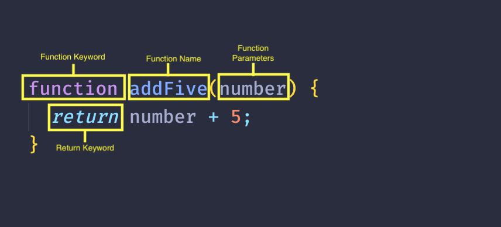

# Session 4

## Recap

In the previous session we covered the following:

- Operators
- Conditonals
- Scope
- Loops (for, while, for..of, for..in)

---

## Functions

When we want to write code, we generally think that we need to write code in one single file and continuously repeat logic: wrong!

One of the key fundamentals of programming is to write useable code that can reduce the amount of repetition (remember D.R.Y?).

Whenever we think we have a block of code that does a specific task (or it can be customised and re-used), this is usually a good indication that we need to put this code into it's only _unit_.

This _unit_ in JavaScript is referred to as a function.

In programming, we tend to put code that achieves a set goal into something we call a function (other languages also use the word _method_).

In JavaScript, nearly all of the time, a function will return a value by which the end user can make use of.

In the following sections we will look at how to create and use a standard function as well as look at improvements in ECMAScript that allow us to use _arrow functions_.

### Overview

JavaScript functions are first-class objects. Therefore:

- They have built-in properties and methods, such as the name property and the .toString() method.
- Properties and methods can be added to them.
- They can be passed as arguments and returned from other functions.
- They can be assigned to variables, array elements, and other objects.

### Standard Functions

Before ES6 (EcmaScript), a function in JavaScript was written using the following structure:



In the example shown the function has a name, _addFive_ and it's intention is to do just that, add 5 to a number. The _number_, here defined as an argument to the function is what will have 5 added to it. The function has a `return` keyword which denotes that the expression/value to the right of it will contain the value.

The function shown has a body, which here is the `return number + 5` line, however more lines can appear here.

The name of a function should start in `camel case`. To call a function you first need to declare it.

When we create a function of any form, the body of the function is referred to as the _function_ scope. We have covered _scope_ before where this was briefly covered.

Let's look at a simple function:

```js
1   function sayHello() {
2       return 'Hello!';
3   }
4
5   console.log(sayHello());
```

What is happening here:

- First we have defined the `sayHello` function which can be seen prefixed with the keyword `function`.
- The function `sayHello` has a single return statement which is the output the `sayHello` will return if invoked (line 2).
- The `sayHello` function is actually **invoked** (line 5). Instead of using console.log, we can also store the output in a variable and subsequently use the output to do another operation.

When the JavaScript interpreter sees lines 1-3 it detects a function has been declared and adds adds a reference to it in memory. A function in JavaScript is actually an object (or considered as one)!

The above example is pretty simple but it shows the basic creation of and usage of a function.

Let's illustrate the use of a function through another example:

```js
const taxYearEnded = true;
const baseSalary = 20000;
const numberOfSales = 1000;
const bonus = 1000;
let commissionRate = 3.0;

if (taxYearEnded) {
    let totalSalary = baseSalary + (numberOfSales * commissionRate);

    if (numberOfSales > 500) {
        // only give bonus when sales exceed 500:
        totalSalary += bonus;

        console.log(`Total salary after bonus: ${totalSalary}`);
    }
}

// sales person 2:
numberOfSales = 300;
baseSalary = 25000;
commissionRate = 2.0;

if (taxYearEnded) {
    let totalSalary = baseSalary + (numberOfSales * commissionRate);
    console.log(`Total salary: ${totalSalary}`);
}
```

Yes, correct, there are a number of issues here:

1. It's slightly difficult to read.
2. The logic to give a bonus is only applied inside one code block.
3. There is some code repetition.

Let's tidy (refactor) this using functions:

```JavaScript
function calculateSalary(taxYearEnded, numberOfSales, baseSalary, commissionRate) {
    if (taxYearEnded) {
        const bonus = 1000;
        let totalSalary = baseSalary + (numberOfSales * commissionRate);

        if (numberOfSales > 500) {
            totalSalary += bonus;

            console.log(`Total salary after bonus: ${totalSalary}`);
        }

        console.log(`Total salary: ${totalSalary}`);
    }
}

const taxYearEnded = true;
const baseSalary = 20000;
const numberOfSales = 1000;
const bonus = 1000;
let commissionRate = 3.0;

// make a call to the function
calculateSalary(taxYearEnded, numberOfSales, baseSalary, commissionRate);

// sales person 2:
numberOfSales = 300;
baseSalary = 25000;
commissionRate = 2.0;

// make a call to the function
calculateSalary(taxYearEnded, numberOfSales, baseSalary, commissionRate);
```

:bookmark:&nbsp; You will have noticed the function was defined _before_ using it. This is deemed a good practice.

:bookmark:&nbsp; The key takeaway when creating functions is that they should do one thing and do it well!

The ability to do one thing and do it well abides to another principle: `Single Responsibility Principle` (SRP).

In 99% of the time in JavaScript, functions will always return a value.

#### Receiving a function value

When we call a function and it returns a value, we can assign that value to a variable.

For example, say we have a function that returns the customer's current account balance:

```JavaScript
function retrieveCurrentAccountBalance(customerNo) {
    return 1000; // dummy value but this would be an actual amount
}

const customerNo = '1234567';

// call function and retrieve value:
const currentBalanceForCustomer = retrieveCurrentAccountBalance(customerNo);

if (currentBalanceForCustomer > 0) {
    console.log(`Customer ${customerNo} is in DEBIT`);
} else {
    console.log(`Customer ${customerNo} is in CREDIT`);
}

```

##### Best Practices for functions

As with everything we should adhere to the following check list to ensure we can achieve clean code when working with `functions`:

- Use `camel case` when naming your functions
- Name your functions correctly and their names should represent what their intention is. Good examples are:

| Good Example | Bad Example | Comment |
| :--: | :--: |:--: |:--: |
| getPersonName | getName | `getName` is too vague. |
| toCelcius | toTemp | `toTemp` is too vague. |

- Functions should do **one thing** and one thing well. The moment you add an _and_ to the function name, you are breaking the principles of SRP.

For example, this is not good:

```js
function getNameAndAddress() {
    // does two things
}
```

Better to extract them into multiple functions:

```js
function getPersonDetails() {
    const name = getName();
    const address = getAddress();
}
```

#### Functions as variables?

You can assign a function to a variable and use that as an alias. These functions are referred to as `anonymous` functions as they dont have a function name:

```JavaScript
var sayHello = function(message) {
    console.log(message);
}

sayHello(`Bonjour!`);
```

We will see more examples of `anonymous` functions in a short while.

#### Passing Arguments to a function

As you have seen already in the previous section that a function may or may not take arguments. An argument to a function is like a local variable for that function only (so think of it as a number of `let` or `const`).

For example:

```JavaScript
function sayHello(message) {
    console.log(message);
}
```

Here `message` is a local variable which cannot be accessed other than between the `{}` braces. You may do whatever you want with `message` inside the braces but not outside of them.

:bookmark:&nbsp; When passing arguments to a function, try and limit the number of arguments to `5`. Otherwise the function can become complex (in terms of controlling arguments).

> 🔖 &nbsp; The difference between an `argument` and `parameter` is that an `argument` is what is provided to a function where as the `parameter` is the name given to the value you're working with. Some people interchange them.

What do you do when you have to deal with multiple arguments then?

##### Handling Too Many Arguments

As mentioned it's a good practice to limit your arguments to 5. There may be cases that you cannot do this but there are ways you can achieve it.

For example let's take the following:

```JavaScript
function printCustomerDetails(firstName, lastName, street1, street2, cityTown, postCode, contactNo) {
    console.log('....');
}
```

This can be changed by merging arguments into say an object:

```JavaScript
function printCustomerDetails(customer) {
    console.log('....');
}

const customer = {
    firstName: 'John',
    lastName: 'Doe',
    street1: 'Test',
    street2: '',
    cityTown: 'London',
    postCode: 'L23 4RF',
    contactNo: '0999988833'
}
```

There is also another way but this will be covered in upcoming sessions but for now you get an idea.

#### Default arguments in a function

To ensure that our applications are robust we can also provide **default** values to our arguments  (just in case someone doesn't pass a value for that argument).

Adding default values is simple. Let's look at another example:

```JavaScript
function adjustOverdraftForCustomer(overdraftLimit = 300, customer) {
    // body ...
}
```

If `overdraftLimit` is to be passed to this function as `null` then the value `300` is used.

```JavaScript
adjustOverdraftForCustomer(null, customer); // this will be fine
```

A default value can be anything provided it is suitable for that particular variable. This is important as the person using your code will be told what they need to send to the function you create. If it is a variable that is an array:

```JavaScript
function printPeopleToConsole(people = []) {
    // body
}
```

Here `people` will default to an empty array thus not causing any errors for any other internal variables of functions that need to work with the array's contents (i.e. we can safely check the `length` of the array knowing it wont be `null` 👌 ).

#### Rest Operator

This is a new syntax that was introduced in ES6 which let's you write functions that allows you take any number of arguments through the aid of an array.

Let's look at an example:

```JavaScript
function add(...nums) {
    // nums is [5, 10, 20]
    return nums.reduce((a, b) => a + b, 0);
}

const result = add(5, 10, 20); // should be 35
console.log(result);
```

You can also add parameters to a function **before** a rest operator:

```JavaScript
function add(count, ...nums) {
    // nums is [5, 10, 20]

    console.log(count);

    return nums.reduce((a, b) => a + b, 0);
}
```

:warning: You cannot however put a parameter after a rest operator. This won't work:

```JavaScript
function add(...nums, count) {
    // caput
}

const result = add(5, 10, 20);
console.log(result);
```


#### Functions with functions as arguments?

Hey?! Yes. You can also pass functions to another function as an argument. This is one of the powerful features of JavaScript (something which will be covered a lot further later on).

A break down of this would look like this:

```js
function func1(function_parameter) {
    function_parameter();
}

function func2() {
    console.log('Fired function 2!');
}

//invoke function 1:
func1(func2);
```

The above pattern is heavily used in JavaScript (without people realising they are). This pattern is used when using `callbacks` (we'll cover this later).

Another example shows how we can pass both a function and value to a function:

```js
function pass(value){
  return ("Hello " + value);
}

function receive_pass(name, func){
  console.log(func(name));
}

receive_pass("David", pass);
```

This will result in `Hello David`.

#### Callbacks

While we are here, it's a good time to cover what is a `callback`.


Everything we do in a browser is asynchronous. We can't determine when things will happen or when we'll get responses to say data coming from an external source.

To alleviate this, JavaScript uses a concept which is called a `callback`, which provides a developer control over the functions being called in the order in which they are meant to be triggered.

Let's look at this scenario:

```
Person 1: Hi, can I drop my car off at the garage to get a service done?
Mechanic: Sure, it should only take us an hour so. What number can be we call you on when its ready?
Person 1: 07000098765
```

Now that's what a call back would be in real life. If we want something done but the time it will be done is underdeterministic we need a way of being told when it's done. This is how JavaScript responds when we say, click a button. Yes we have clicked the button but there may be a set of actions happening based off that click that then decides to say, fetch a list of flight details or comparison data for us to then select from. 

A `callback` is the way we can achieve such scenarios.

The whole idea is we need to somehow work in an synchronised manner but in the _asynchronous_ world of JavaScript:

Let's look at an example:

```js
setTimeout(function() {
    console.log('Hello');
}, 1000);
```

This special `setTimeout` function allows to add a delay on trigger a set of actions. The first argument it takes is a `callback` function which will be invoked when the second argument is expires, which is a timeout in milliseconds.

We can move this first argument into it's own entity:

```js
function sayHello() {
    console.log('Hello');
}

setTimeout(sayHello, 1000);
```

Now this is fine but if we look at it in an actual JavaScript manner:

```js
console.log('1');

function sayHello() {
    console.log('Hello');
}

setTimeout(sayHello, 1000);

console.log('3');
```

Which order will the messages render? This is because we simulated a delay in the process which is usually what happens when you interact with web browsers or back end APIs. This topic will be cover towards the end of the bootcamp but for now, the concept that we can pass a function as a parameter to another is a powerful thing to understand as we will now see in the upcoming sections.

### Arrow Functions

Arrow functions, also referred to as fat arrow functions, were introduced in ES6 to (a) initially remove the ambiguity around the `this` keyword and it's use within function and (b) to help reduce the amount of code written (i.e. to simplify how functions are written).

:exclamation: The same concepts around passing arguments and default values for arguments also applies to Arrow Functions

Let's see an arrow function:

```JavaScript
const sayHelloWorld = () => {
    console.log(`Hello World`);
}

sayHelloWorld();
```

Arrow functions were introduced to remove the extra code needed to make `anonymous` functions as well as the previous reason around the `this` keyword (which referred to the context of what the interpreter was looked at).

An arrow function can again have as many arguments as you like as well as the default values as previously demonstrated.

For the remainder of this bootcamp and to encourage you all to use `arrow functions`, I'll be using them instead of the standard ones.

#### Returning values from Arrow Functions

Arrow functions also return values just like standard ones. However arrow functions further provide a means of less code.

For example:

```JavaScript
const sumIt = (num1, num2) => {
    return num1 + num2;
}
```

Now this is fine but it can be further simplified.

When there is only `one` line, you can do the following:

```JavaScript
const sumIt = (num1, num2) => num1 + num2;
```

The `{}` are removed as is the keyword `return` which is now implied by using the arrow function :fire:

When your arrow function body stems over several lines, then you must use the keyword `return` just as normal:

```JavaScript
// This could be further simplified but for demonstration:
const sum = (a, b) => {
    let result = a + b;

    return result;
}
```

### Standard Vs Arrow? Which One?

Ideally you want to move towards using the Arrow function way of writing code. Why? Because of the reasons previously mentioned that standard functions are good for simple activities but as your code grows you may run into confusion when using the keyword `this`.

Other reasons to prefer Arrow functions are:

- Less code.
- Make for cleaner looking code.
- They fit into the pattern used by High Order functions such as `filter`, `map` etc meaning your code follows a set pattern.
- It's newer and more browsers will support it. Move with the times.

### Why Arrow Functions though? What's the difference between the standard function?

As the previous section mentioned, there is a key difference and that is how the `this` keyword is interpreted.

Let's look at this through an example:

ButtonExample.html:

```html
<body>
  <button id="myBtn">Click Me</button>

  <script>
    const myBtn = document.getElementById("myBtn");
    myBtn.addEventListener("click", function () {
      console.log(this); // this will render the button itself, it refers to the object that called the function
    });

    /*
        myBtn.addEventListener('click', () => {
            console.log(this); // this will now show window
        });
        */
  </script>
</body>
```

Essentially there is **no binding** with the this keyword when using an arrow function.

> The way the 'this' keyword is treated is just like a variable. The interpreter says 'where is `this` defined, it's not inside the curly braces so I'll go outside. Outside then refers to the `window`.

What about objects?

```html
<script>
  const myObj = {
    bottle: function () {
      console.log(this);
    },
  };

  /*
    // let a = 50;
    const myObj = {
        bottle: () => {
            console.log(this);
            //console.log(a);
        }
    };
    */
</script>
```

### Void Functions

When we say `void` what do we mean? Void in plain english means a 'completely empty space'. When we use `void` in programming, it refers to returning `nothing'.

We have seen that we can define a function in JavaScript that returns a value. In some cases in JavaScript (mostly front end), there will be a use of `javascript:void(x)` where the `x` can be replaced by an action to perform or `0`.

When you call a function on its own without passing it's value to a variable it will return `undefined`:

```js
function und() {    
}

und();
```

This will return `undefined`.

But what about `javascript:void`? 

`javascript:`

This is referred to as a Pseudo URL. When a browser receives this value as the value of href on an anchor tag, it interprets the JS code that follows the colon (:) rather than treating the value as a referenced path.

Say we had this on our HTML page:

```html
<a href="javascript:console.log('javascript');alert('javascript')">Link</a>
```

When the link is clicked, it will log to the console and render a pop up but not leave or refresh the page which a link usually would do. This is because JavaScript does not treat the link as a referenced path, instead it treats it as some JavaScript code.

`void(0)`

The void operator evaluates given expressions and returns undefined.

For example:

```js
const result = void(1 + 1);
console.log(result);
// undefined
```

`1 + 1` is evaluated but `undefined` is returned. 


For further reading on the use of `void`, refer to this [blog](https://www.geeksforgeeks.org/what-is-void-and-when-to-use-void-type-in-javascript/).

### Functions: Guard Expressions

Most of the time we will face logic that requires us to create a function that can return multiple outcomes. For example, returning say we wanted to prompt a user to enter their email address if they did not provide it, otherwise if they did, we send them an email:

Say we started with this:

```js
const sendEmail = (to, subject, body) => {
    if (to) {
        // send email and return response ...
    } else {
        return 'Please enter email address'
    }
}
```

This could be improved using a _guard expression_ which is used to move the edge case/failure case first and then if we have the expected value, we can carry on as normal. This way the code is not having to check unnecessary _if else_ logic:

```js
const sendEmail = (to, subject, body) => {
    if (!to) {
        return 'Please enter email address'
    } 
        
    // send email and return response
}
```

This also makes it easier to read! Win win ✅

For further reading refer to [this](https://medium.com/@jakepintu/javascript-functions-e66ed8871771) blog.

### Functions: Best Practices

There are a number of key best practices that you should adhere to when writing functions:

- A function should do one thing - and do it well.
- If a function takes arguments, try to keep the arguments below 5.
- Usually it's good practice to ensure that you have `default` values for your arguments.
- Function names should describe the `action` or `purpose` that that function is trying to achieve.
- Keep your functions succinct. If your function stems over several lines of code, ask yourself "Can I further reduce this and move some code into other functions?".

<div style="text-align: left; padding: 20px 10px; border: 1px solid silver; margin: 30px 0px;">

<div style="margin-top: -60px; margin-left: 75px;">
<p>Challenge: String Expression</p>

Write a program such that when given a string parameter, which will perform a mathematical operation and return the result, in words.

Numbers 0-9 and the symbols "plus" and "minus" are the only inputs allowed in the single parameter the program recieves.

For example:

```
stringExpression( "onezeropluseight" ) -> "oneeight"
stringExpression( "oneminusoneone" ) -> "negativeonezero"
```

</div>
</div>

<div style="text-align: left; padding: 20px 10px; border: 1px solid silver; margin: 30px 0px;">

<div style="margin-top: -60px; margin-left: 75px;">
<p>Challenge: Parking Charges</p>

<p>NCP would like you to create a program that calculates the cost of parking based on the time of day:</p>

```text
Given the following charge criteria:

  Hour 0 is deemed as midnight
  Hour 1 is 1am
  Hour 13 is 1pm

  - Hours between midnight to 5am costs 300
  - Hours between 5am to 10am costs 350
  - Hours between 10am to 3pm costs 500
  - Hours between 3pm to 8pm costs 700
  - Hours between 8pm to midnight costs 400
```

Your function should take an hour value as an argument and return a cost.
</div>
</div>


---

## High Order Functions

We have seen that a function can be passed another function as a parameter. Functions themselves can also return functions. This is what high order functions are.

A vast choice of high order functions are available in the `Array` data structure.

### For Each

An array variable has some built-in methods but it also allows us to use some built-in methods that are high order functions. One of which is the `forEach`.

The `.forEach` method executes a callback function on each element in an array _in order_. 

For example:

```js
const numbers = [28, 77, 45, 99, 27];

numbers.forEach(number => console.log(number)); 
```

A key thing to note here is that each element is visited in a `forEach`.

We can expand this to performing a `forEach` on an array of say, objects:

```js
const albums = [
    { title: 'Master of Reality', artist: 'Black Sabbath' }, 
    { title: '2001', artist: 'Dr. Dre'}, 
    { title: 'Wish You Were Here', artist: 'Pink Floyd' }
];

albums.forEach(album => console.log(album));
```

You can think of a `forEach` as an abbreviated, functional way of doing a `for`, `for...in` or `for..of` loop.

We can extend the usage of `forEach` which allows us to use an index which tells us the index of the element we are iterating over (useful of we wanted to say, print the position of elements in the output):

```js
const countries = ['France', 'Germany', 'England'];

countries.forEach((country, index) => console.log(`${index + 1} ${country}`));
```

If we were to flip the same country example as a standard for loop:

```js
for (let i = 0; i < countries.length; i++) {
    console.log(`${i + 1} ${countries[i]}`);
}
```

### Filtering elements

We can also filter elements from an array based off a callback function which provides us a mechanism to determine if an element should be `filtered` or not.

The callback function provided to `filter` must return `true` or `false`.

The result of the `filter` method is to return a new array of the filtered elements (or an empty array if nothing was filtered).

To filter an array using just a standard for loop:

```js
const numbers = [1, 2, 3, 4, 5 ,6];

const evenNumbers = numbers.filter(number => n % 2 === 0);
console.log(evenNumbers);
```

We can also externalise the function passed to the `filter`:

```js
const LOYAL_MIN_YEARS = 3;

const findLoyalCustomers = (customer) => customer.numberOfYearsJoined >= LOYAL_MIN_YEARS;

const customers = [
    {
        name: 'John Doe',
        numberOfYearsJoined: 5
    },
    {
        name: 'Jill Smith',
        numberOfYearsJoined: 2
    },
    {
        name: 'John Doe',
        numberOfYearsJoined: 3
    }
];

const loyalCustomers = customers.filter(findLoyalCustomers);
console.log(loyalCustomers);
```

In the above example, the `findLoyalCustomers` function is used to provide the filtering mechanism. JavaScript performs a magic `push` operation on the `customers` array by passing each element to the function for us to determine a `true` or `false` outcome.

The filtering callback function can contain any logic as long as you guarantee a boolean outcome.

### Transforming elements (Map)

The `map` method executes a callback function on each element in an array. It returns a new array made up of the return values from the callback function.

The original array does not get altered (which means no mutation occurs), and the returned array may contain different elements than the original array.

For example:

```js
const goalScorers = [ 
    { name: 'Ronaldo', goals: 20 }, 
    { name: 'Messi': goals: 30 }, 
    { name: 'Mbappe', goals: 15 } 
];

const goalsAnnouncements = goalScorers.map(scorer => {
    return `${scorer.name} has scored ${scorer.goals} goals this calendar year`;
});

console.log(goalsAnnouncements);
```

As you can see the original array is not what the resulting array looks like (or vice versa :D ). We can say it has been _transformed_.

We can also use the `map` to extract parts to transform from an original array:

```js
const people = [
    { firstName: 'Will', lastName: 'Smith' },
    { firstName: 'Megan', lastName: 'Fox' },
    { firstName: 'Tom', lastName: 'Cruise' },
];

const peopleNames = people.map(person => {
    return {
        name: `${person.firstName.substring(0, 1)}. ${person.lastName}`
    }
});
```

This will result in transforming the `people` array and return a new array as:

```
W. Smith
M. Fox
T. Cruise
```

### Reduce

Another commmonly used high order function is `reduce`.

The `.reduce` method iterates through an array and returns a single value.

The `reduce` method takes a callback function which has two arguments, an `accumulator` and a `current value`.

Let's look at an example:

```js
const arrayOfNumbers = [1, 2, 3, 4];

const sum = arrayOfNumbers.reduce((accumulator, currentValue) => {  
  return accumulator + currentValue;
});

console.log(sum); // 10
```

In the above code example, the `.reduce` method will sum up all the elements of the array. It takes a callback function with two parameters (`accumulator`, `currentValue`) as arguments. On each iteration, `accumulator` is the value returned by the last iteration, and the `currentValue` is the current element. Optionally, a second argument can be passed which acts as the initial value of the accumulator (so in the above example, the second argument would be `0`).

You're probably wondering why would we need scuh a method? Let's look at another example:

Say we had the following products and our goal was to get the total for all items in a shopping basket:

```js
const shoppingBasket = [
    { name: 'Shirt', price: 10 },
    { name: 'Jumper', price: 20 },
    { name: 'TV', price: 300 },    
]
```
We could use a `forEach`:

```js
let total = 0;

shoppingBasket.forEach(item => {
    total += item.price;
});
console.log('Total is', total);
```

This is fine but the purpose of the `reduce` method is to reduce the value down to a single value, which is what we want here:

```js
const totalBasketCost = shoppingBasket.reduce((total, item) => {
    console.log(`Total: ${total}`);
    console.log(`Item Price: ${item.price}`);

    return total + item.price
}, 0);
console.log('Total is', totalBasketCost);
```

The `reduce` like the `forEach` and `map` methods loops through all items.

Let's look at reduce using objects as an outcome. What if we wanted to group vehicles by their `type`:

```js
const vehicles = [
    { model: 'Golf', manufacturer: 'Volkswagen', type: 'CAR' },
    { model: '', manufacturer: 'Suzuki', type: 'MOTORBIKE' },
    { model: '', manufacturer: 'Ford', type: 'VAN' },
    { model: 'A5', manufacturer: 'Audi', type: 'CAR' },
    { model: 'X3', manufacturer: 'BMW', type: 'CAR' },
    { model: '', manufacturer: 'Citreon', type: 'VAN' },
]

const result = vehicles.reduce((groupedVehicles, vehicle) => {
    const carType = person.type;

    if (groupedVehicles[carType] === null) {
        groupedVehicles[carType] = [];
    }

    groupedVehicles[carType].push(vehicle);
}, {});

console.log(result);
```

Here `result` will be reduced down to a _single_ object containing vehicles with each categorised in arrays by their `type`.

Which method you use dependents solely on the end goal and what is you're trying to achieve. For example we can even combine a few of them:

```js
const posts = [
    { id: 11231413, email: 'foo@test.com', nickname: 'foo', likes: 27 },
    { id: 11231415, email: 'bar@test.com', nickname: 'bar', likes: 7 },
    { id: 11231416, email: 'yoda@test.com', nickname: 'yoda', likes: 17 },
];

// finding all posts that have likes over 10 and returning their nickname and email only:
const result = posts.filter(p => p.likes > 10)
                    .map(item => {
                        return {
                            email: item.email,
                            nickname: item.nickname
                        }
                    });

console.log(result);
```

In the above example we have _chained_ two high order functions together to produce a result. We couldn't use `reduce` at any stage as the requirement was not to render a single object, nor were we accumulating anything.

🔖 &nbsp;The only difference is that the `forEach` cannot be chained onto as it is seen as a `termination` method that only receives data and doesn't produce any output.

### Sort

We touched on the default `sort` method on an array when we covered Arrays. We can also make use of the `callback` version of the `sort` method which allows us to pass a function, which acts as the _comparator_ in our sort method.

For example:

```js
const pokemonCharacters = [
    {name: 'Shuckle', defenceScore: 67 },
    {name: 'Mega Aggron', defenceScore: 45 },
    {name: 'Mega Steelix', defenceScore: 88 },
    {name: 'Blissey', defenceScore: 58 },
];

// order them by score then, name:
const sortedCharacters = pokemonCharacters.sort((a, b) => b.defenceScore - a.defenceScore || a.name.localeCompare(b.name));
console.log(sortedCharacters);
```

Here we have passed a function to the `sort` method, which we could have even moved to a seperate function if we wanted to re-used for example:

```js
// ... 

const sortPokemonByScoreAndName = (pokemon1, pokemon2) => pokemon2.defenceScore - pokemon1.defenceScore || pokemon1.name.localeCompare(pokemon2.name);

// order them by score then, name:
const sortedCharacters = pokemonCharacters.sort(sortPokemonByScoreAndName);
console.log(sortedCharacters);
```

There are libaries available in `NPM` that let you do more sophisticated sorts on arrays and arrays of objects, such as the library _underscore_ but try to avoid bringing in third party libraries unless necessary.

### Finding at least one match inside an array

We can also make use of a useful high order function called `some` which is available on an array. This function provides a _short circuit_ way of determining if an array contains a matching criteria. You can also think of it as similar to `includes`:

```js
const numbers = [1, 2, 3, 4];

const isEven = (number) => number % 2 === 0;
const hasNumberAbove10 = (number) => number > 10;

console.log(numbers.some(isEven); // returns true

console.log(numbers.some(hasNumberAbove10)); // returns false
```

The `some` method takes a callback function that is used to determine a condition against each element. The difference here with `some` is it exists as soon as the first negative match exists.

### Finding a match against ALL elements in an array

What if we wanted verify that all elements in an array meet the same criteria? We can use the `every` method that allows us to run a condition against each element and return `true` if **all** elements match the criteria.

For example:

```js
const checkIsAdult = (age) => age >= 18;

const ages = [34, 23, 20, 26, 12];

let isAllAdults = ages.every(checkIsAdult); // false

if (!isAllAdults) {
    console.log('All members must be at least 18 years of age.');
}

const adultAges = [ 23, 34 ];

console.log(adultAges.every(age => age >= 18)); // true
```

This will result in:

```
All members must be at least 18 years of age.
true
```

<div style="text-align: left; padding: 20px 10px; border: 1px solid silver; margin: 30px 0px;">

<div style="margin-top: -60px; margin-left: 75px;">
<p>Challenge: User Comments</p>

Given the following user posts data, write a program to find a user and their comments when provided a user’s name.

You should return the user and their comments as new object.

Extension: Find users who havent commented

Following on from the previous exercise, find users who have not commented.
</div>
</div>

<div style="text-align: left; padding: 20px 10px; border: 1px solid silver; margin: 30px 0px;">

<div style="margin-top: -60px; margin-left: 75px;">
<p>Challenge: String Alphabetical</p>

Write a program that when given a string, it returns that string in alphabetical order.

For example:

```
input: “webmaster”
output: “abeemrstw”
```

</div>
</div>

<div style="text-align: left; padding: 20px 10px; border: 1px solid silver; margin: 30px 0px;">

<div style="margin-top: -60px; margin-left: 75px;">
<p>Challenge: Seven Boom</p>

<p>Create a function that takes an array of numbers and returns the word ‘Boom!’ if the number 7 appears in the array. Otherwise return ‘No booming here’.</p>

Examples:

```js
sevenBoom([1, 2, 3, 5, 7]) => ‘Boom!’
sevenBoom([1, 2, 3, 5, 9]) => ‘No booming here’
sevenBoom([1, 2, 3, 5, 97]) => ‘Boom!’
```
</div>
</div>
---

## Objects - Revisited

We have looked at objects when we looked at data types and data structures. As a reminder, an object can hold any data type and relies on having a key value pair as an entry.

An example of an object is:

```js
const person = {
    name: 'John Doe',
    age: 18,
    hobbies: [
        'football',
        'books'
    ],
    allergies: [
        'hayfever'
    ]
};
```

If we want to display the contents of an object in JavaScript, we can use the `JSON.stringify` function which allows us to print the object to a console as a string:

```js
console.log(JSON.stringify(person)); // {"name":"John Doe","age":18,"hobbies":["football","books"],"allergies":["hayfever"]}
```

An object can also contain a function. Yes, a function! Let's expand our example:

```js
const person = {
    name: 'John Doe',
    age: 18,
    hobbies: [
        'football',
        'books'
    ],
    allergies: [
        'hayfever'
    ],
    toString: function() { 
        return `My name is ${this.name} and I am ${this.age} years old` 
    }
};

console.log(person.toString());
```

The key here is when using a function inside an object, it has to be the `function` keyword as the context of the `this` keyword has a different meaning. In this example, the `this` refers to the object that is being accessed.

### Dot Notation

When we want to access properties of an object there are two mechanisms that can be used.

To access a property of an object we can either:

- use the dot notation
- use the bracket notation

In this seciton we will focus on the dot notation mechanism.

Let's take a look at we can access various properties of a complex object:

```js
const person = {
    firstName: `Jil`,
    lastName: `Smith`,
    age: 45,
    dateOfBirth: '1977-02-03',
    hobbies: ['cycling', 'crafts', 'music'],
    address: {
        addressLine1: '1st Foo St',
        addressLine2: null,
        city: 'London',
        postalCode: 'W12 5TY',
        longitude: 34.5,
        latitude: -89.0,        
    },
    posts: [
        {
            id: 1232424324,
            comment: 'Hi there',
            ts: '2022-09-09T10:34:30'
        },
        {
            id: 123992424,
            comment: 'Bye',
            ts: '2022-09-09T10:36:30'
        }
    ],
    dateJoined: '2022-01-01',
    lastLogin:  '2022-03-05T09:00:45',
    email: 'jill@foo.com'
}

// access name:
console.log(`${person.firstName} ${person.lastName}`); 

// access hobbies and crafts:
console.log(person.hobbies[1]);

// access the last post:
console.log(person.posts[person.posts.length - 1]);
```

Why use `dot notation`?

- Faster to write and clearer to read
- Dot notation also renders faster in a browser

A useful blog on dot notation can be found [here](https://codeburst.io/javascript-quickie-dot-notation-vs-bracket-notation-333641c0f781).

### Bracket notation

The bracket notation is used in a similar manner to how we access elements in an array. The syntax is the same.

Here is an example using the same object as before:

```js
const person = {
    firstName: `Jil`,
    lastName: `Smith`,
    age: 45,
    dateOfBirth: '1977-02-03',
    hobbies: ['cycling', 'crafts', 'music'],
    address: {
        addressLine1: '1st Foo St',
        addressLine2: null,
        city: 'London',
        postalCode: 'W12 5TY',
        longitude: 34.5,
        latitude: -89.0,        
    },
    posts: [
        {
            id: 1232424324,
            comment: 'Hi there',
            ts: '2022-09-09T10:34:30'
        },
        {
            id: 123992424,
            comment: 'Bye',
            ts: '2022-09-09T10:36:30'
        }
    ],
    dateJoined: '2022-01-01',
    lastLogin:  '2022-03-05T09:00:45',
    email: 'jill@foo.com'
}

// access name:
console.log(`${person['firstName']} ${person['lastName']}`); 

// access hobbies and crafts:
console.log(person['hobbies'][1]);

// access the last post:
console.log(person['posts'][person.posts.length - 1]);

```

The bracket notation:

- Allows access to properties containing special characters and selection of properties using variables (which you can't when using the dot notation)
- Is useful when dealing with property names which vary in a predictable way:

```js
const myForm = {
    myControlNumber1: 'foo',
    myControlNumber2: 'bar',
}

for (var i = 0; i < 10; i++) {
  someFunction(myForm["myControlNumber" + i]);
}
```


### Optional Chaining

You will be working more and more with objects when you develop in JavaScript. These could be objects that you return from a function or objects that you receive from a back end API (this is when a server sends you the data. We will see this later in the bootcamp 🆒 ).

One issue many developers have faced when using the _dot notation_ is trying to access an object that you _assume_ has a property and that property has a value. As you know there is no guarantee that will always happen and as a result, you had to add _defensive logic_ to guard against such scenarios:

```js
const person = {
    firstName: `Jil`,
    lastName: `Smith`
}

// we assume the user has a 'lastLoggedIn' property:

console.log(person.lastLoggedIn); // undefined
```

When looking for a property at one level deep is fine but when you need to deep dive into an object and extract a different property it can become a wasted journey:

```js
const person = {
    firstName: `Jil`,
    lastName: `Smith`,
    address: {
        addressLine1: '1st Foo St',
        addressLine2: null,
        city: 'London',
        postalCode: 'W12 5TY',
        longitude: 34.5,
        latitude: -89.0,        
    },
    posts: []
}

console.log(person.address.posts[0]); // Uncaught TypeError: Cannot read properties of undefined (reading '0')
    
```

If we look at this simple example, it will show why we should use optional chaining:

```js
let user = {}; // a user without "address" property

console.log(user.address.street); // Error!
```

That’s the expected result. JavaScript works like this. As `user.address` is `undefined`, an attempt to get `user.address.street` fails with an error.

In many practical cases we’d prefer to get `undefined` instead of an error here (meaning “no street”).

So you may be thinking it's easier to just write a ternary:

```js
let user = {};

const street = user.address ? user.address.street : undefined;
console.log(street);
```

It works, there’s no error... But it’s quite inelegant. As you can see, the `user.address` appears twice in the code.

For more deeply nested properties, it becomes even uglier, as more repetitions are required.

```js
let user = {}; // user has no address

console.log(user.address ? user.address.street ? user.address.street.name : null : null); // <-- eugh
```

There’s a little better way to write it, using the `&&` operator:

```js
let user = {}; // user has no address

console.log( user.address && user.address.street && user.address.street.name ); // undefined (no error)
```

This would check each expression and only give us the name if existed or `undefined`. good but not great. As you can see, property names are still duplicated in the code. E.g. in the code above, user.address appears three times. That’s why the optional chaining ?. was added to the language. To solve this problem once and for all!

```js
let user = {}; // user has no address

console.log( user?.address?.street ); // undefined (no error)
```

The key to remember with the optional chaining operator, `?` is that:

- It provides a means to _short circuit_ access to a property. The `?.` immediately stops (“short-circuits”) the evaluation if the left part doesn’t exist.
- Don't overuse the optional chaining operator. If we know that the user will always exist but the address may be optional, then do `user.address?.street` and not this `user?.address?.street`.
- The variable before the `?.` must be declared.

### Destructuring

This is a new feature that was introduced in ES6, and to be fair, its one of the coolest ones in my opinion.

As we work with objects and arrays the need to use a heap load of variables becomes somewhat a neccessary habit as a developer. Accessing properties of an object or access elements from an array to then use their values to initialise other variables just makes you tired even thinking about it! Enter _destructuring_.

Let's look at Array destructuring first then we'll look at how it used with objects.

#### Destructuring Arrays

Let's say we wanted to extract elements from an array and store their values into independent variables. Well could do this:

```js
const countries = ['France', 'Brazil', 'Germany'];
const france = countries[0];
const germany = countries[2];
```

Great, but this needs us to declare several variables on multiple lines and access the elements by index. Introduce some magic:

```js
const [france, brazil, germany] = ['France', 'Brazil', 'Germany'];
console.log(france, brazil, germany);
```

🦸 Using destructuing we have managed to _extract and pop_ values from an array directly into their respective left hand side variables

If we wanted to say, skip the second element we can do this:

```js
const [france,,germany] = ['France', 'Brazil', 'Germany'];
console.log(france, germany);
```

The use of destructuring Arrays is useful when we use arrays inside a function or even when we receieve them as arguments to a function.

#### Destructuring Objects

As we saw earlier, we can use the dot notation and square bracket notation to extract properties from an object. What if we had a requirement to then extract each property into its own variable:

```js
const person = {
    firstName: `Jil`,
    lastName: `Smith`,
    address: {
        addressLine1: '1st Foo St',
        addressLine2: null,
        city: 'London',
        postalCode: 'W12 5TY',
        longitude: 34.5,
        latitude: -89.0,        
    },
    posts: []
}

// shortened from brevity:
const firstName = person.firstName;
const lastName = person.lastName;
const address = person.address;

```

This is all well but once we get into ancomplex object it then becomes variable overload and chaos 😱

If we use destructuring on an object things become more succinct:

```js
const { firstName, lastName, address, posts } = {
    firstName: `Jil`,
    lastName: `Smith`,
    address: {
        addressLine1: '1st Foo St',
        addressLine2: null,
        city: 'London',
        postalCode: 'W12 5TY',
        longitude: 34.5,
        latitude: -89.0,        
    },
    posts: []
}

console.log( firstName, lastName, address, posts );
```

What!? 🙆 We have destructured the object and created a `firstName`, `lastName`, `address` and `post` variable 💥

Not only is this cleaner, its much more leaner.

What if we wanted to destruct a nested property such as `address`?

```js
const { address: { city, postalCode } } = {
    address: {
        addressLine1: '1st Foo St',
        addressLine2: null,
        city: 'London',
        postalCode: 'W12 5TY',
        longitude: 34.5,
        latitude: -89.0,        
    }
}

console.log( city, postalCode );
```

Note the more you want to destruct, you need to wrap the property inside curly braces 🆒

### Renaming variables when destructuring

We may want to rename a variable to differ from the name it has been given as the property name. This can happen if we are say, receiving data from an external system and the property name is not what we need it to be:

```js
const { dob: dateOfBirth } = {
    firstName: `Jil`,
    lastName: `Smith`,
    dob: '1965-09-09'
}

console.log( dateOfBirth );
```

Here we have renamed `dob` to `dateOfBirth` so it is more readable. This is a common trait as sometimes we cannot guarantee how someone else may provide us the object and it's content.

### Destructing arguments in a function

Now that you've seen destructuring in action, you may or may not be surprised to know that it can also be applied to function arguments.

Let's revisit a function we used earlier:

```js
const sendEmail = (to, subject, body) => {
    // body ....
}

// invoke this function
sendEmail('Foo@test.com', 'hello', 'how was your day?');
```

This is fine but not ideal as we have to guess what we are passing for each argument (as we are solely relying on the naming of the variables). We could improve this by turning the function to accept an object:

```js
const sendEmail = ({to, subject, body}) => { // this now takes a single argument that is destructed!
    // body ....
}

// invoke this function
sendEmail({
    to: 'Foo@test.com', 
    subject: 'hello', 
    body: 'how was your day?'
    });
```

This is a common practice and seen as a best practice for both declaring arguments as well as destructuring them. Whenever someone now uses the `sendEmail` function, they will be aware that it now takes an object which a `to`, `subject` and `body` property. Furthermore, it allows for easy extensibility, i.e. we can further properties and not have to worry about the number of arguments the function is recieving 👍