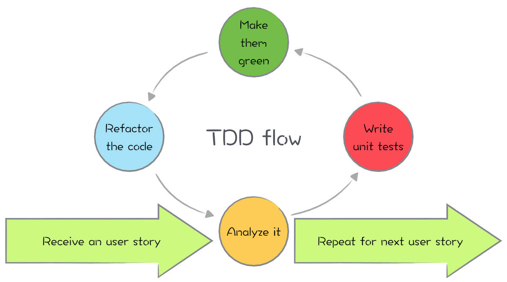

# Session 6

## Recap

In the previous session we covered the following:

- Error Handling
- Mutation
- Testing introduction

---

## Testing - Revisited

We have briefly looked at how we can set up and use `Jest` to write and run tests in JavaScript. 

### Recap

As a refresher, let's look at another coding example of how we write and run tests:

```js
// area-utils.js
export const calculateCircleArea = (radius) => 3.14 * (radius * radius);
```

Now the test for this can be simply:

```js
// using common-js:
const calculateCircleArea = require('area-utils.js'); // import {calculateCircleArea} from './area-utils.js';

// area-utils.test.js

test('Given a radius, should calculate correct circle area', () => {
    const expectedArea = 12.566;

    expect(calculateCircleArea(2)).toBe(expectedArea);
})
```

Now this is fine and we have used the `toBe` matcher, but `Jest` offers a whole list of different matchers for each assertion scenario.

### Exploring Matchers

We have used `toBe` but we can use a vast list of matchers (based on the value we are trying to verify). A full list of matchers is listed [here](https://jestjs.io/docs/expect).

You can also look at [this](https://devhints.io/jest) cheat sheet.

For the sake of keeping things succint, we'll look at some of the common matchers ...

We can also negate a verification, or say the test should pass when we don't expect a value to match using the `not` as part of the chain:

```JavaScript
import { add } from './Calculator'; // no JS extension needed when using Node

test('When given two numbers, their sum is returned', () => {
  // Arrange:
  const num1 = 1;
  const num2 = 1;

  // Act:
  const result = add(num1, num2);
  
  // Assert:
  expect(result).toBe(2); // the 'toBe' is an assertion function

  expect(result).not.toBe(10);
})
```

When we work with arrays, we tend to use the `toEqual` matcher as this checks the content of the variable is the same content in an expected array.

```JavaScript
test('Should contain the correct shopping basket items', () => {
  const result = shoppingBasket.getCart();

  expect(result).toEqual(['apples', 'coke', 'milk']);
})
```

Say we had some text we wanted to make sure matched a given criteria using say a regular expression. We can verify this using the `toMatch` matcher:

```JavaScript
test('Should match date of birth pattern', () => {
  const result = '12-09-2009';

  // Assert:
  expect(result).toMatch(/^\d{2}\-\d{2}\-\d{4}/);
})
```

Delving back into arrays; what if we wanted to verify that the array contained a particular entry? We can using the `toContain` matcher:

```JavaScript
test('Should contain pears', () => {
  const result = ['apples', 'pears', 'bananas'];

  // Assert:
  expect(result).toContain('pears');
})
```

#### Troubleshooting: Using Jest in VS Code

You may have an issue whereby VS Code does not give you intellisense (i.e. when type CTRL-space to get available options), for the `expect` functions used by `jest`. To resolve this, add the following content to a file called `jsconfig.json` and add it to the root of your project:

```
{
    "typeAcquisition": {
        "include": [
            "jest"
        ]
    }
}
```

### Code Coverage

When using `Jest` or other frameworks, you also get this added feature that allows you to check whether your code is actually covering all bases and "is my code actually being used?"

That feature is `code coverage`. Most organisations if not all will have a set of thresholds (allowed targets) that will act as a quality benchmark so whenever we run code coverage against our code, those thresholds should not be broken. If they are, then they help to flag up potential issues with your code: have you left code in that you wont need? is your code actually doing what it's intended to do?

To run a code coverage report using `jest`, we can simply create a new script in our `package.json` and then run that script:

```
"scripts": {
    "test": "jest",
    "test:coverage: "jest --coverage"
  }
```

You can in theory add the `--coverage` on the same line as `test` but we do not want to run code coverage every time we change or write a new test (it takes times to perform code coverage as it will scan your whole code base and check every knuck and cranny).

To run the code coverage we can do:

```
$ npm run test:coverage
```

Now code coverage is not the holy grail and be all end all, but it does help steer confidence in terms of the quality of the code being produced. It is available as a means of providing an indication to the development team to know if any new code has hindered, the _code coverage_.

---

## Test Driven Development: TDD

### Why TDD?

Part of your team is kept out of the loop during the creation of requirements, specifications, or user stories

- Most, if not all, of your tests are manual, or you don't have tests at all
- Even though you have automated tests, they do not detect real problems
- Automated tests are written and executed when it's too late for them to provide a real value to the project
- There is always something more urgent than dedicating time to testing
- Teams are split between testing, development, and functional analysis departments, and they are often out of sync
- An inability to refactor the code because of the fear that something will be broken
- The maintenance cost is too high
- The time-to-market is too big
- Clients do not feel that what was delivered is what they asked for
- Documentation is never up to date
- You're afraid to deploy to production because the result is unknown
- You're often not able to deploy to production because regression tests take too long to run
- Team is spending too much time trying to figure out what some method or a class does

Test-driven development is defined by the following lifecycle:

1. Write the test code before implementation code.
2. Only write new code when the test is failing.
3. (Not just for TDD), Rerun tests every time implementation code changes.
4. (Not just for TDD), All tests should pass before new test is written.
5. (Not just for TDD), Refactor only after all tests are passing, and again rerun all tests after refactor to ensure nothing has broken.

This figure illustrates the cycle:



> In essence, the quality of the code will increase by the increase in the number of tests you write as we are ensuring that we are covering all scenarios.

### TDD: In Action

Now that we have an idea of how to organise and write a test using `jest`, let's tackle a few KATAS.

<div style="text-align: left; padding: 20px 10px; border: 1px solid silver; margin: 30px 0px;">

<div style="margin-top: -60px; margin-left: 75px;">
<p>Challenge: Password Checker</p>

We have been asked to ensure that passwords entered on a website follow a required criteria.

This criteria is:

- At least 8 characters long
- Contains at least one letter
- Contains at least one number

When all of these are met than a password is deemed to be of the required format.

</div>
</div>

To begin with, we need to create a `validate-password.test.js` file and also a supporting implementation file, `validate-password.js`.

#### Password Checker walkthrough

Our first tests could be to to get us started, testing for an empty string:

```js
const validatePassword = require('./validate-password.js'); // import { validatePassword } from './validate-password'

describe('Password Checker', () => {
    it('should return false when provided an empty password', () => {
        expect(validatePassword("")).toBeFalsy();
    });
})
```

This test just gets us going and into a TDD mindset. Now run this test and add the minimal logic required to make this pass:

```js
const validatePassword = () => false;
```

:D &nbsp;this is mad, yes it's passed and yes it's the minimal amount of code but it's truly embarrasing.

Ok, let's check for a case where a `truthy` outcome would be produced:

```js
const validatePassword = require('./validate-password.js'); // import { validatePassword } from './validate-password'

describe('Password Checker', () => {
    // ... other tests

    it('should return true when password is 8 characters or longer, has a letter and a number', () => {
        expect(validatePassword("12345678a")).toBeTruthy();
    });
})
```

Now our tests when we run them, one will fail 🔴 , so we need to write code to make all tests pass 🟢 :

```js
const validatePassword = (password) => {
    if (password.length >= 8) {
        return true;
    }
    return false;
};
```

Great! All passing 🟢 . Can we refactor? I think so:

```js
const validatePassword = (password) => password.length >= 8;
```

As this will either return true or false regardless.

> NOTE: Refactoring doesn't only apply to implementation code, you can also refactor your tests to tidy them up or use functions to help reduce the code.

The next criteria or scenario we need to cover is receiving a password that is 8 characters in length but contains no letters:

```js
describe('Password Checker', () => {
    // ... other tests

    it('should return false when password is 8 characters or longer but has no letters', () => {
        expect(validatePassword("123456789")).toBeFalsy();
    });
})
```

Ok so this fails because there is no check to see if it contains a letter or not so  we end back up in the 🔴 zone. Time to get this to go 🟢 :

```js
const validatePassword = (password) => 
    password.length >= 8 && /[a-z]/g.test(password);
```

Can we refactor? Hmmm maybe there is a pattern forming:

```js
const validatePassword = (password) => {
    const hasCorrectLength = password.length >= 8;
    const hasLetters = /[a-z]/g.test(password);

    return hasCorrectLength && hasLetters;
} 
```

Re-run the tests to ensure nothing has broken due to the refactor.

Moving on, another test we can add is to verify that we retur false if the password only contains letters:

```js
describe('Password Checker', () => {
    // ... other tests

    it('should return false when password is 8 characters or longer but has no numbers', () => {
        expect(validatePassword("abcdefghi")).toBeFalsy();
    });
})
```

Again, this fails because there is no check to see if it contains a number or not so  we end back up in the 🔴 zone. Time to get this to go 🟢. We can continue our pattern:

```js
const validatePassword = (password) => {
    const hasCorrectLength = password.length >= 8;
    const hasLetters = /[a-z]/g.test(password);
    const hasNumbers = /[0-9]g/g.test(password);

    return hasCorrectLength && hasLetters && hasNumbers;
} 
```

Re-run the tests, we should see all tests now passing 🟢

Ok let's further add tests to check for a few more scenarios. One is can we accept both lower case and upper case letters:

```js
describe('Password Checker', () => {
    // ... other tests

    it('should return false when password is 8 characters or longer but has only upper case letters', () => {
        expect(validatePassword("ABCDEFGH")).toBeFalsy();
    });
})
```

This fails as our regular expression is only looking for lower case letters. Let's fix this and re-run tests:

```js
const validatePassword = (password) => {
    const hasCorrectLength = password.length >= 8;
    const hasLetters = /[a-zA-Z]/g.test(password);
    const hasNumbers = /[0-9]g/g.test(password);

    return hasCorrectLength && hasLetters && hasNumbers;
} 
```

If we re-run the tests they should now all be passing 🟢

Our next scenario is just checking that the length is catered for correctly rather tha just an empty password:

```js
describe('Password Checker', () => {
    // ... other tests

    it('should return false when password is less than 8 characters', () => {
        expect(validatePassword("A1")).toBeFalsy();
    });
})
```

This passes, that's fine. More tests just further covers the scenarios we may face.

This is TDD in a nutshell. We: 

1. Write a test to cater for a given criteria
2. Run the test
3. Write the minimal code required to make the test pass
4. Refactor is required
5. Repeat steps 1-4 until all criteria ad scenarios have been handled

One scenario we did not cater for is receiving a `null` password:

```js
describe('Password Checker', () => {
    // ... other tests

    it('should throw an error when null password provided', () => {
        expect(() => validatePassword("ABCDEFGH")).toThrow(Error);
    });
})
```

If we run this test it will fail as we haven't handled this scenario.

Let's add the required logic:

```js
const validatePassword = (password) => {
    if (password === null) {
        throw Error('Password not provided');
    }

    const hasCorrectLength = password.length >= 8;
    const hasLetters = /[a-zA-Z]/g.test(password);
    const hasNumbers = /[0-9]g/g.test(password);

    return hasCorrectLength && hasLetters && hasNumbers;
} 
```

What we did is perform a `guard` clause which prevents the logic from continuining into our code by adding the `if` statement and throwing an `Error` early.

<div style="text-align: left; padding: 20px 10px; border: 1px solid silver; margin: 30px 0px;">

<div style="margin-top: -60px; margin-left: 75px;">
<p>Challenge: Temperature Converter</p>

When given:

- Fahrenheit, a value should be converted to Celsius
- Celsius, a value should be converted to Fahrenheit

Tip:

To obtain temperature in Celsius: (F - 32) / 9 x 5

To obtain temperature in Fahrenheit: (C * 1.8) + 32

Write several tests to ensure the above calculations provide the correct result. 

You may use an online converter to check for expected results.
</div>
</div>

> We have tackled a few TDD challenges, although you could have done these without TDD, the idea is to understand how to adopt using TDD in your every day coding experience.

### DRY also includes tests

When writing tests we may come across scenarios where we create the same logic for our _arrange_ several times.

A key feature in `Jest` and other frameworks is the concept of using a `beforeEach` function. In here we can define logic that is to be initialised and used _before each test_ runs.

```JavaScript
const initialiseDB = () => {
  // some initialisation logic ...
}

describe('City database', () => {
  beforeEach(() => {
    initialiseDB();
  });

  // tests ...

});
```

In this example we have initialised a database which will happen for **before** each test inside that `describe` block runs. However what if we want to reset the database after?

We can use the `afterEach` block:

```JavaScript
const initialiseDB = () => {
  // some initialisation logic ...
}

const resetDB = () => {
  // some reset logic ...
}

describe('City database', () => {
  beforeEach(() => {
    initialiseDB();
  });

  afterEach(() => {
    resetDB();
  })

  // tests ...

});
```

What if we wanted to just initialise the database once at the start of all tests rather than before each one? We can use the `beforeAll`:

```JavaScript
describe('City database', () => {
  beforeAll(() => {
    initialiseDB();
  });

  // tests ...

});
```

You guessed it, there is also an `afterAll` :grin: :

```JavaScript
describe('City database', () => {
  afterAll(() => {
    dropDB();
  });

  // tests ...

});
```

The beforeXXX blocks/functions are usually referred to as _set up_ functions. The afterXXX blocks/functions are usually referred to as _teardown_ functions.

> The key takeaway when using the beforeXXX and afterXXX functions is where you place them. If you place them outside a `describe` block then they will have global scope. If you place them inside a `describe` block then they become _local_ to _that_ `describe` block.

---

## Pair Programming

We are all kings or queens of our castles but from time to time you do need an extra pair of hands to complete a task that you would otherwise struggle to complete alone.

This is where a way of working, Pair Programming, was introduced into the software world. It could be seen as an Agile thing.

So what is pair programming? Anyone like to take a wild guess?

Pair programming is where two developers work together on an issue/feature/whatever using only one machine. Each developer has a keyboard and mouse. One programmer acts as a driver who codes while the other, you could think of an observer, who will check the code being written, proofread and check for spelling mistakes, whilst also trying to figure out which steps to take next.

Other phrases you may come across is when someone says "let pair", "let program in pairs". You get the idea.

So whats good about it?

### Advantages of Pair programming

- We've all heard that phrase "two heads are better than one". If you are doing something alone, you're less likely to find
an issue than you're if you were to pair up.
- More efficient. Some say it slows delivery down as you're having two people on one job but in general it is more
efficient.
- Fewer coding mistakes. An extra pair of eyes and constant discussions as to not just what you're doing, but why.
- Share of knowledge. In industry we call it bus factor. Explain bus factor.
- Develops your interpersonal skills as you're having to work and communicate with someone.

### Different Types of Pair Programming

So we've all got different ways of doing things. This is no different when it comes to pair programming.

There are several styles of Pair Programming:

- Unstructured Pairing - This is where you work alone and then something crops up so you grab your mate or someone next to
you and you indirectly start working on the same thing, together, at the same machine.

- Driver-Navigator - My best one. This is where you have a driver, just like you would when you're going on a journey. The Driver
is responsible for the tactical concerns such as the mechanics of what you're tying to achieve. This is like being in a car,
where the driver would control the accelerator, brakes etc. So in programming terms, the driver would handle typing,
navigating between files and the basic implementation.

The navigator, however, is responsible for looking at the big picture. Are we going on the right journey?

- Back Seat Navigator - Similar to the one before but this time the navigator is the one who shouts the orders. The Driver
merely follows suit. This usually happens where you have an expert navigator and a novice driver.

- Tour Guide - This is where one is basically the one who is driving the bus and explaining everything they are doing, why
you're doing it etc. The other participant is just a tourist. Cant do anything other than sit, and ...watch.

- Ping-Pong - This is a common one. This is where you have one developer who writes a failing test. The other then steps
in to fix it. The process repeats. Hence ping-pong. We'll come to this later.

- Distributed - This is becoming more common these days. This is where you pair programme, but remotely.

### Paired challenge

<div style="text-align: left; padding: 20px 10px; border: 1px solid silver; margin: 30px 0px;">

<div style="margin-top: -60px; margin-left: 75px;">
<p>Challenge: FizzBuzz</p>

Write a program that:

- Returns "fizz" if the number is a multiple of 3
- Returns "buzz" if its multiple of 5
- Returns "fizzbuzz" if the number is divisible by <b>both</b> 3 and 5. 

If the number is not divisible by either 3 or 5 then it should just return the number itself.

Added Challenge:

Enhance your program to print out the outcome if provided a range of numbers 1 to 20 (i.e. a min and a max). 

For example it should print:

1 2 fizz 4 buzz fizz ...
</div>
</div>

---

## Mobbing

Another technique used in industry is mobbing. This is where groups of developers gather in a huddle to tackle a somewhat tougher, more challenging requirement. 

Each developer starts as if they were dealing with the requirement on their own in a TDD manner but at the same time, their thoughts are aired to the group who also help the individual in their logic or tests. The idea around mobbing is that a joint effort is made to tackle the challenge and share the work involved to evolve the tests as well as provide the logic.

Each developer takes a designnated time to write tests and the supporting code. Once the time is up, the next person in line takes control and continues. Just think you are all making the same dish but everyone conntributes to it.

### Mobbing challenge

<div style="text-align: left; padding: 20px 10px; border: 1px solid silver; margin: 30px 0px;">

<div style="margin-top: -60px; margin-left: 75px;">
<p>Challenge: Roman Numerals</p>

Given you have this <a href="https://en.wikipedia.org/wiki/Roman_numerals">link</a> to refer to for the Roman numerals ...

Your task is to write a function that converts numbers to their roman numeral equivalent

I.e. 

```
1 gives letter 'I'
10 gives letter 'X'
7 gives VII
```

Your function can be:

```
const toRoman = (number) => { ... };
```
</div>
</div>

--- 

<div style="text-align: left; padding: 20px 10px; border: 1px solid silver; margin: 30px 0px;">

<div style="margin-top: -60px; margin-left: 75px;">
<p>Challenge: String Calculator</p>

Casio would like to introduce a calculator program that takes a string and can perform the add operation on all numbers provided.

The requirements are as follows:

1. The calculator method should take 0, 1 or 2 numbers (such as 1,2). An empty string should return an empty string.
2. Allow the Add method to handle an unknown amount of numbers.
3. Allow the Add method to handle new lines between numbers instead of commas.
4. Support multiple delimiters to separate the numbers between the numbers.
5. Passing negative numbers will be handled by producing an exception.
6. Numbers bigger than 1000 should be ignored. So if passing 1001 + 2 then this should result in 2.

Extension: Add the divide, multipley and substract operations. Existing functionality should not break.
</div>
</div>